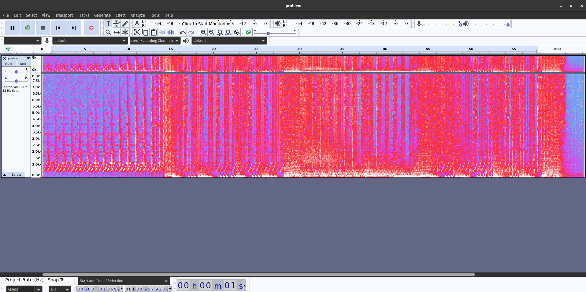

## CDDC'23: Audio Steganography
This was a slightly more complex(more than usual for me) audio steganography challenge which required the use of `least significant bits`.

## The Challenge
```
Found a suspicious audio file. Seems like... something is hidden inside... Identify the character strings.
```

Along with this was a file, `problem.wav`.

## Analysis
Usually, when tackling audio steganography challenges, I would use  `Audacity` to view the spectrogram of the audio file. However, when taking a look at this (literally a) `problem.wav`, there didn't seem to be anything I could get.



I had to look up other steganography methods, and found that a famous approach is using the Least Significant Bit algorithm, or LSB for short. It works by:
> ...substituting the least significant bit of each sampling point with a binary message

## The Solution
I couldn't find any online tool that gave an accurate result (or a result at all, actually), so I tried to write a Python script with reference to others' in GitHub repos. 

What I did was to:
1. Open file in read-binary mode
2. Read all audio frames and convert them to a byte array (list of bytes)
3. Extract the LSB from each byte
4. Convert binary data back to string
5. Remove filler characters

```python
import os
import wave

current_folder = os.path.dirname(__file__)
wavefile = os.path.join(current_folder, 'problem.wav')

with wave.open(wavefile, mode='rb') as song:
    frame_bytes = bytearray(list(song.readframes(song.getnframes())))

extracted = [frame_bytes[i] & 1 for i in range(len(frame_bytes))]
string = "".join(chr(int("".join(map(str,extracted[i:i+8])),2)) for i in range(0,len(extracted),8))
decoded = string.split("###")[0]

print("Sucessfully decoded: "+decoded)
```

This gave us the flag: `CDDC2023{tH15_15_AuD10_5t39aNo9rAphy}`!