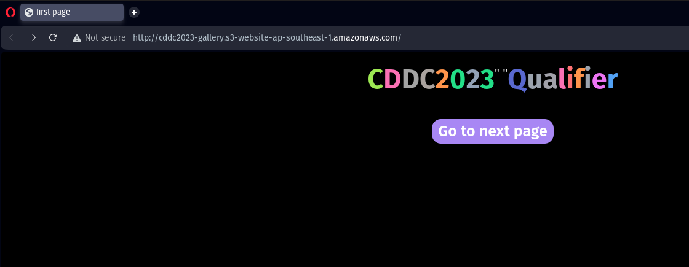
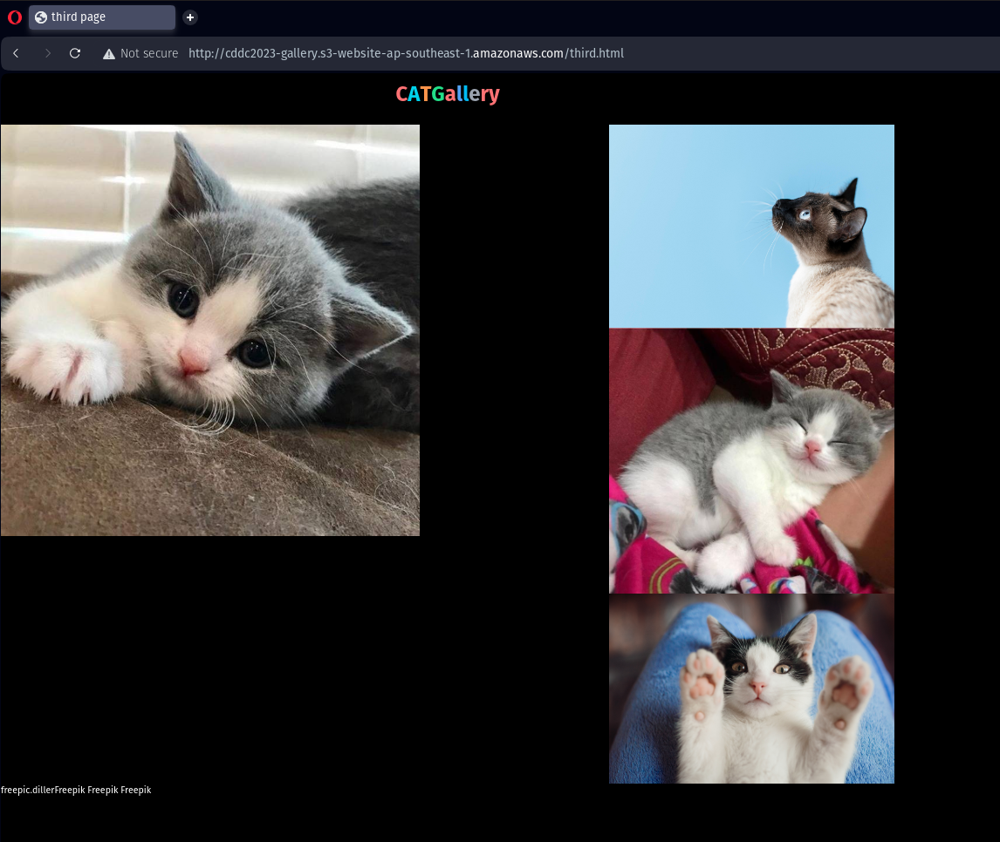
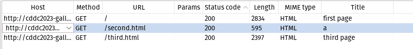
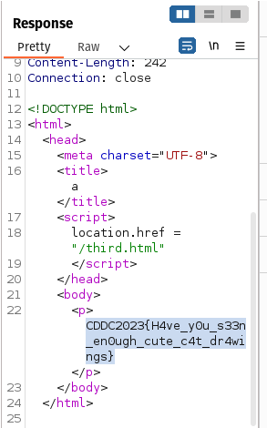

## CDDC'23: Gallery
This was a pretty simple web challenge which 

## The Challenge

```md
Humans are dumb and horrible, but cats are terribly CUTE!! - said an AI.

Access Info: http://cddc2023-gallery.s3-website-ap-southeast-1.amazonaws.com/
```

Upon accessing the website, we are greeted by this landing page:



Clicking on the `Go to next page` button brings us to this page:



This is pretty odd, since it should be going to `second.html` before `third.html`, but there is a redirect straight to `third.html`.

## The solution

Using Burp Suite, I accessed the website. Repeating the actions did show that there was indeed, a `second.html`.



Great. Taking a look at the contents of it, 



We seem to have found our flag!