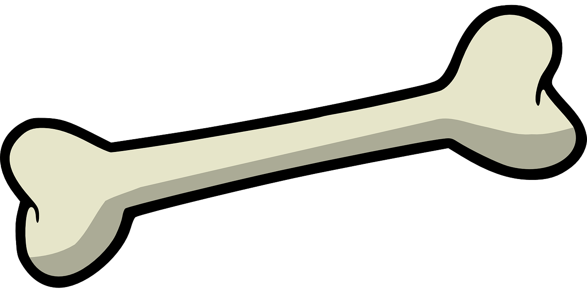
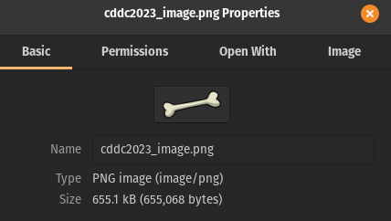
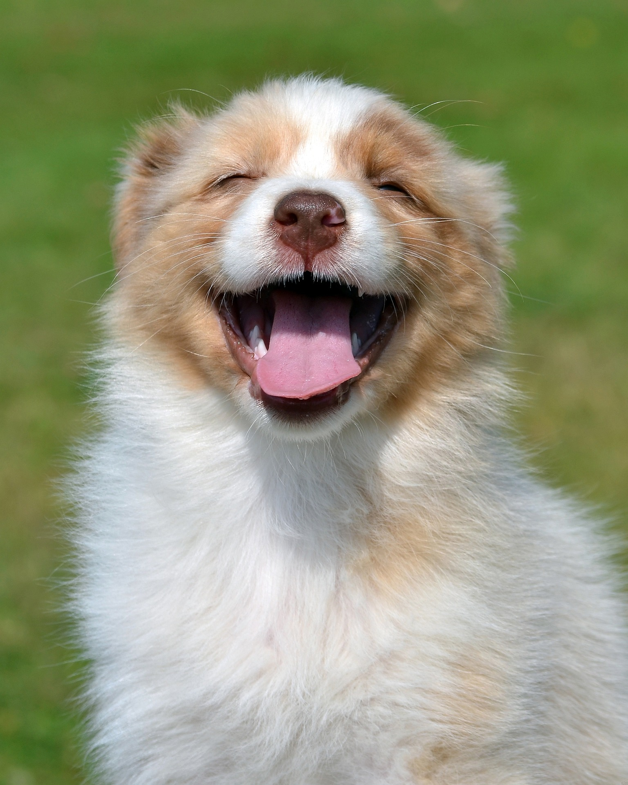

## CDDC'23: Owner of the dog chew

This was a pretty interesting steganography challenge which required the analysis of `strings` and using `binwalk`.

## The Challenge

```md
Found a piece of bone on the ground. Let's find the owner.
```

The file given was the following image:



Looking into the image properties:



It was 655kB, which seemed a little too large for a file as small as this.

## Solution

The first thing I did was to look at the strings. Scrolling down to the end, I could see this:

```
cddc2023_puppy.jpg
pw : i'm_hungry
```

Seems like this involves another image file and a password. Next, I used binwalk to try and extract any hidden files:

```bash
kairos@pop-os:~/Downloads/Owner_of_the_dog_chew$ binwalk -e cddc2023_image.png 

DECIMAL       HEXADECIMAL     DESCRIPTION
--------------------------------------------------------------------------------
0             0x0             PNG image, 1280 x 640, 8-bit/color RGBA, non-interlaced
41            0x29            Zlib compressed data, best compression
94485         0x17115         Zip archive data, encrypted at least v2.0 to extract, compressed size: 560398, uncompressed size: 561761, name: cddc2023_puppy.jpg
655031        0x9FEB7         End of Zip archive, footer length: 22
```

Seems like we got a zip file! Looking at the output files, I could see a password-protected zip file. Using the password above, I could then unzip it.

Unzipping it gave an image:


Once again, I tried to look at `strings`. And sure enough, it  got us our flag!

```bash
CDDC2023{H4pPy_puPpy}
```