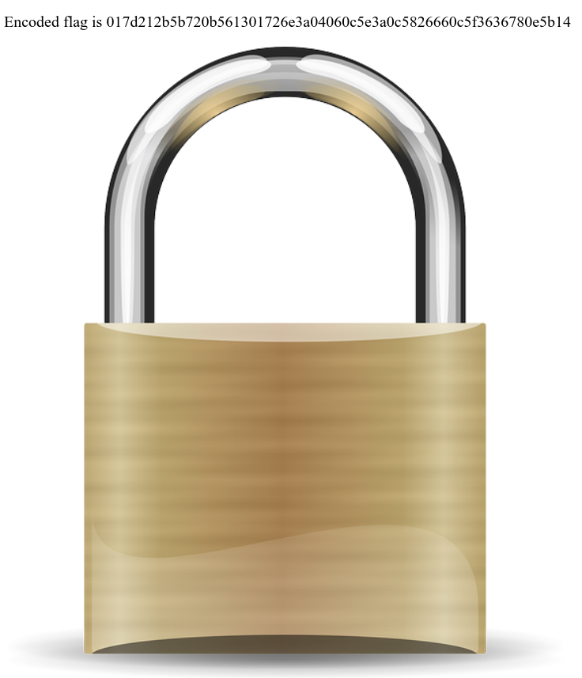
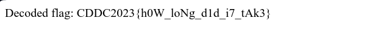

## CDDC'23: The Key

This was a JS reverse engineering challenge which required some sort of brute forcing/iterating. 

## The Challenge

```md
Discovered the files and character strings that Skynetwork was using! Find out what lies in it...
```

The challenge included 3 files: `encode.js`, `img.png`, and `index.html`.
Opening up `index.html` gave us this:



So we have an encoded flag
```md
Encoded flag is 017d212b5b720b561301726e3a04060c5e3a0c5826660c5f3636780e5b14
```

and the source code:
```js
/**
 * Convert charCode array to hex string
 * @param   {array}  target - A target text(charCode array)
 * @returns {string}        - A hex string
 */
function CharCodeArrToHexString(target) {
    let result = "";

    target.forEach(charCode => {
        result += ("00" + charCode.toString(0x10)).slice(-2);
    });

    return result;
}

/**
 * Xor plain using key
 * @param   {array} plain - A plain text(charCode array)
 * @param   {array} key   - A key text(charCode array)
 * @returns {array}       - A encoded text(charCode array)
 */
function xor(plain, key) {
    let encoded = [];

    for (let i = 0; i < plain.length; i++)
        encoded.push(plain[i] ^ key[i % key.length]);

    return encoded;
}

/**
 * Generate random key
 * @param   {int}    keyLen - A length of key
 * @returns {string}        - A key
 */
function generateKey(keyLen) {
    const chars = "ABCDEFGHIJKLMNOPQRSTUVWXYZabcdefghijklmnopqrstuvwxyz0123456789";
    let charsLen = chars.length;

    let key = "";

    for (let i = 0; i < keyLen; i++)
        key += chars.charAt(Math.floor(Math.random() * charsLen));

    return key;
}

/**
 * Convert string to charCode(int) array
 * @param   {string} target - A string value
 * @returns {array}         - A charCode array
 */
function stringToCharCodeArr(target) {
    let arr = [];

    for (let i = 0; i < target.length; i++)
        arr.push(target.charCodeAt(i));

    return arr;
}

/**
 * Encode plain text
 * @param   {string} plain  - A plain text
 * @param   {int}    keylen - A length of key
 * @returns {string}        - A encoded text
 */
function encode(plain, keyLen) {
    let key = generateKey(keyLen);

    let plainArr = stringToCharCodeArr(plain);
    let keyArr = stringToCharCodeArr(key);

    encodedArr = xor(plainArr, keyArr);

    return CharCodeArrToHexString(encodedArr);
}

window.onload = () => {
    const flag = /* "CDDC2023{...}" */ "";
    let encodedFlag = /* encode(flag, 5) */ "017d212b5b720b561301726e3a04060c5e3a0c5826660c5f3636780e5b14";

    let flagElem = document.getElementById("flag");
    flagElem.innerText = "Encoded flag is " + encodedFlag;
}
```

## Analysis

Looking at the source code, these were the steps in encoding the flag:

1. `CharCodeArrToHexString(target)`: Converts array of character codes to a hex string.
2. `xor(plain, key)`: XORs two arrays of character codes to encode the text.
3. `generateKey(keyLen)`: Generates a random key of the specified length.
4. `stringToCharCodeArr(target)`: Converts the string to an array of character codes.
5. `encode(plain, keyLen)`: Encodes a plain text using a random key. The encoded flag is provided as a hex string.

## Solution

Knowing that the flag was in the format of `CDDC2023{...}`, I started working on the script.

1. Initialising the Variables
Firstly, I had to intialise some variables:
```js
const chars = "ABCDEFGHIJKLMNOPQRSTUVWXYZabcdefghijklmnopqrstuvwxyz0123456789";
let charsLen = chars.length;
let decodedFlag = "";
```
    - `chars` was just grabbed from the `encode.js` file.
    - `charsLen` was just its length
    - `decodedFlag` to store the decoded flag, which was initially empty.

2. Iterate Through the Key Lengths
Next, I made a loop to iterate through possible key lengths, which was from 1 to half of the encoded flag's length. 

```js
for (let keyLen = 1; keyLen <= encodedFlag.length / 2; keyLen++) {
    ...
    
```

This is just the outer loop for the key lengths.

3. Key Generation
Inside the loop, I had to generate all possible keys for the current key length. 
```js
for (let i = 0; i < Math.pow(charsLen, keyLen); i++) {
    ...
}
```
Within that loop, I now needed to generate the individua keys. For each key length, I used a nested loop to create keys of different lengths, using `i` to represent the key, using characters in `chars`. Next, `num % charsLen` was to select the characters from the character set, appending them to the `key` variable. This was to generate all possible keys of the current length.

4. Decoding using XOR
```js
let decoded = "";
for (let k = 0; k < encodedFlag.length; k += 2) {
    let charCode = parseInt(encodedFlag.substr(k, 2), 16) ^ key.charCodeAt(k % keyLen);
    decoded += String.fromCharCode(charCode);
}
```
This step involves decoding the encoded flag using the generated key. It iterates through the encoded flag in pairs of characters, treating each pair as a hexadecimal number `(parseInt(encodedFlag.substr(k, 2), 16))`. It then XORs this number with the corresponding character code from the key. The result is a character, which we add to the `decoded` string.

5. Checking for Flag Format
```js
if (decoded.startsWith("CDDC2023{")) {
    decodedFlag = decoded;
    break;
}
```
After decoding, we check if the decoded text starts with the flag format "CDDC2023{". If it does, we set the decodedFlag to the decoded text, indicating that we found the flag, and break out of the loop.

6. Exiting and Returning Result
```js
if (decodedFlag !== "") {
    break;
}

return decodedFlag !== "" ? decodedFlag : "Flag not found.";
```
If we found the flag in a previous iteration, we break out of the outer loop as well. This helps avoid unnecessary iterations once the flag is discovered.Finally, we return the decoded flag if it was found during the decoding attempts. If no valid flag is found, we return a message stating that the flag was not found.

With the full JS code now, I just added it into a new `index.html` file by wrapping the code in `<script> </script>` tags, and launching the site.

```html
<!DOCTYPE html>
<html>
<head>
    <title>Solution</title>
    <script>
       
        function reverseEngineer(encodedFlag) {
            const chars = "ABCDEFGHIJKLMNOPQRSTUVWXYZabcdefghijklmnopqrstuvwxyz0123456789";
            let charsLen = chars.length;

            let decodedFlag = "";

            for (let keyLen = 1; keyLen <= encodedFlag.length / 2; keyLen++) {
                for (let i = 0; i < Math.pow(charsLen, keyLen); i++) {
                    let key = "";
                    let num = i;

                    for (let j = 0; j < keyLen; j++) {
                        key += chars.charAt(num % charsLen);
                        num = Math.floor(num / charsLen);
                    }

                    let decoded = "";
                    for (let k = 0; k < encodedFlag.length; k += 2) {
                        let charCode = parseInt(encodedFlag.substr(k, 2), 16) ^ key.charCodeAt(k % keyLen);
                        decoded += String.fromCharCode(charCode);
                    }

                
                    if (decoded.startsWith("CDDC2023{")) {
                        decodedFlag = decoded;
                        break;
                    }
                }

                if (decodedFlag !== "") {
                    break;
                }
            }

            return decodedFlag !== "" ? decodedFlag : "Flag not found.";
        }

        window.onload = () => {
            const encodedFlag = "017d212b5b720b561301726e3a04060c5e3a0c5826660c5f3636780e5b14";

            let flagElem = document.getElementById("flag");
            flagElem.innerText = "Decoded flag: " + reverseEngineer(encodedFlag);
        }
    </script>
</head>
<body>
    <div id="flag"></div>
</body>
</html>

```

Eventually, I did get the flag :D although it took a realllyyyy long time.


## Food for Thought
Of course, since this is a brute forcing method, it would take a while. I carried on with the other challenges while waiting on this. However, other teams did try using `dcode.fr` to check for the flag instead. 

Still, it is a brute force way, since they downloaded all of the possible solutions and looked through them, piecing together the flag.
