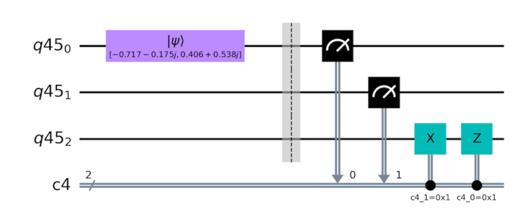

# Quantum Conundrum

This was my first quantum-related CTF challenge which I was hoping to use
quantum computing concepts to solve. The intended solution required one to
implement a quantum teleportation algorithm, which I could not comprehend and
ended up exploiting an insecure `eval` to achieve RCE.

## Description

> KORP™, the heartless corporation orchestrating our battles in The Fray,
> has pushed us to our limits. Refusing to be a pawn in their twisted game,
> I've learned of a factionless rebel alliance plotting to dismantle KORP™.
> While it may sound like mere whispers, there's a chance it holds truth.
> Rumors suggest they've concealed a vital communication system within The Fray,
> powered by cutting-edge quantum computing technology. Unfortunately, this
> system is reportedly malfunctioning. If I can restore this communication
> network, it could be the key to toppling KORP™ once and for all. However, my
> knowledge of quantum computing is limited. This is where you come in! As I
> infiltrate The Fray to access the system, I'll rely on your expertise to
> identify and repair the issue. Are you up for the challenge? Together, we can
> make a difference in this battle against oppression.

The source code for the challenge can be found [here](misc_quantum_qonundrum.zip)
, or on HackTheBox's [Github](https://github.com/hackthebox/cyber-apocalypse-2024/tree/main/misc/%5BMedium%5D%20Quantum%20Conundrum).

---

## Challenge Overview

This challenge takes in a user's input and parses it into either a Hadamard
or CNOT gate, and appends it to a quantum circuit that is then executed on a
Qiskit runner. The user input should be a `dict` containing 2 keys, `type` and
`register_indexes`, as directed by `communication_system/instructions_set.py`.

A circuit is constructed with the 0th qubit initialized to a random value,
and the grey area/dotted line shown below is populated with the user's inputs.



## Getting the Flag

TODO: Write about the solve condition

## Intended Solution

The intended solution requires the user to make use of these gates to construct
a quantum teleportation algorithm. It makes use of the Hadamard and CNOT gates
to entangle the qubits together, allowing for a state to be "copied" to another
qubit. [This](https://github.com/qiskit-community/qiskit-community-tutorials/blob/master/Coding_With_Qiskit/ep5_Quantum_Teleportation.ipynb)
Jupyter notebook does a great job of explaining the details and contains working
snippets of code to "teleport" the qubit state in Qiskit.


---

## We do a Little Pentesting

When doing research for post-quantum cryptography for an assignment I had a few
months back, I came across this theorem called the no-cloning theorem. It basically
states that any quantum state cannot be cloned and thus no two qubits can be identical.
The quantum teleportation algorithm violate this theorem as it "destroys"
the state of one qubit before "copying" it to another.

Since the way to grab the flag was to somehow "clone" the state of the first
qubit into the second, I thought that this was impossible and maybe it was
just a deep rabbit hole (In hindsight, this rabbit hole seems a little *too deep*).
Thus, I went on a journey to look for other attack vectors.

## Hey Ma, Look an Eval Function

While poking around at the code, I realized that the commands (or dictionaries)
were parsed using an `eval` function with *some* safeguards. It checks if the
keys `register_indexes` and `type` exists, and limits the `register_indexes`
based on how many gates a `type` accepts.

```py
class CommunicationSystem:
    # ...
    def add_instructions(self, instructions: typing.List):
        if len(instructions) > 10:
            raise CommunicationSystemException("Instruction set is too big")
        [self._add_gate(CircuitInstruction(**(eval(gate)))) for gate in instructions]  # Eval here
```

```py
class CircuitInstruction(BaseModel):
    # ...
    @model_validator(mode="before")
    @classmethod
    def _check_instruction(cls, values: typing.Dict) -> typing.Dict:
        if not values["register_indexes"]:  # Checks if the key "register_indexes" exist
            raise CommunicationSystemException(
                "Instruction doesn't contain any register index"
            )
        match values["type"]:  # Checks the type and limits the register indexes
            case "cnot":
                if len(values["register_indexes"]) > 2:
                    raise CommunicationSystemException("Wrong register indexes number")
            case "hadamard":
                if len(values["register_indexes"]) > 1:
                    raise CommunicationSystemException("Wrong register indexes number")
            case _:
                raise CommunicationSystemException("Wrong gate type")
        return values
```

As there were no blacklists for command injection implemented for this
`eval` function, I realized that this could be exploited to gain remote
code execution.

---

## Attempted Eval Exploitation

In a locally deployed testing environment, I uploaded a simple
`__import__("os").system("cat secret.py")` and it worked flawlessly.
However, it only printed to the console running the server, and not the
socket connection that I was using to interface with the challenge.
In other words, nothing was returned on my screen, other than an error
message complaining that my command was not in a proper format.


Thankfully, the server gives us a nice gadget to send any output
back to the client.

```py
def connect_to_system(req: typing.Any) -> None:
    try:
        # ...
    except CommunicationSystemException as cse:
        try:
            req.sendall(f"\n{cse}\n".encode())
        except Exception:
            pass
    # ...
```

This part of the server allows us to raise a `CommunicationSystemException` with a
custom payload, such as `raise CommunicationSystemException("pwned")`, and the
payload should be echoed back to the client.

However, `eval` only allows us to run [expressions](https://stackoverflow.com/questions/2220699/whats-the-difference-between-eval-exec-and-compile)
, which can be thought of as anything on the right of an `=` sign.
Using `x = 3 + 2` as an example, the expression would be `3 + 2`.
Since we are inside a `eval`, if we directly try to raise a
`CommunicationSystemException`, it would be invalid as
`x = raise Exception()` is not a valid statement in Python.

```py
>>> x = raise Exception()
  File "<stdin>", line 1
    x = raise Exception()
        ^^^^^
SyntaxError: invalid syntax
```

## Actual Eval Exploitation

Thankfully, we can circumvent this by wrapping our code inside an `exec` function.
Since `exec` returns something, `x = exec("...")` is a perfectly valid statement
in Python. Let's combine the exception gadget and this exec block to try and
get the server to echo back a payload.


Nice! Now we can issue an `os` command to read `secret.py` and raise a
`CommunicationSystemException` with the content of `secret.py`! Since
`os.system` [does not return the output of the process](https://stackoverflow.com/questions/3503879/assign-output-of-os-system-to-a-variable-and-prevent-it-from-being-displayed-on)
, we can use `os.popen('cmd').read()` instead.

Final payload:

```py
exec("raise CommunicationSystemException(__import__('os').popen('cat secret.py').read())")
```


Flag: `HTB{4lways_us3_a_b3ll_4_t3leportat1on}`
