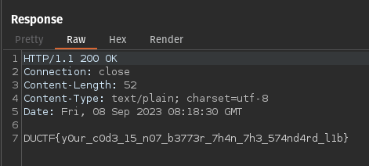

# Actually Proxed

This post is a continuation of the previous `proxed` challenge. If you haven't read the writeup for it, I strongly suggest reading up on it [here](/writeups/ductf_23/proxed) before reading this post!

## Description

> Still cool haxxorz only!!! Except this time I added in a
> reverse proxy for extra security. Nginx and the standard
> library proxy are waaaayyy too slow (amateurs). So I wrote my
> own :D

The source code can be downloaded [here](actually-proxed.tar.gz).

## Overview

When we look at the source code, we can see that there are 2 folders, `proxy` and `secret_server`.


Within the `secret_server` folder, the code is the same as the original `proxed` challenge. As a quick reminder, this code is responsible for parsing HTTP headers, extracting the IP address from the `X-Forwarded-For` header, and checking if it matches the IP address `31.33.33.7` If they match, the flag is returned.

However, the `proxy` folder brings a twist to the challenge. Upon reviewing the code, we can see that it parses the request and appends our own IP address to the end of the HTTP header. Thus, we won't be able to solve it by just passing an `X-Forwarded-For` header with the matching IP address, as it'll simply be overwritten with the appended IP address 😔

```go
func main() {
    // ...
    clientIP := strings.Split(conn.RemoteAddr().String(), ":")[0]
    // ...
}

func parseRequest(raw []byte, clientIp, targetHost string) (*http.Request, error) {
    // ...

    for i, v := range headers {
        if strings.ToLower(v[0]) == "x-forwarded-for" {
            headers[i][1] = fmt.Sprintf("%s, %s", v[1], clientIP)
            break
        }
    }

    // ...
}
```

## Explanation + Possible Vulnerability

In the `parseRequest` function described above, it iterates through the headers and searches for the presence of `X-Forwarded-For`. It then appends our `clientIp` to the end of the header. Sadly, it seems that `clientIp` cannot be modified.

However, it's important to note that `X-Forwarded-For` can contain multiple IP addresses in the format: `X-Forwarded-For: 127.0.0.1, 8.8.8.8`. The `secret_server` handles this by extracting the last IP address in the list.

A closer examination of the code reveals that it breaks out of the loop after finding the first occurrence of `X-Forwarded-For`.

```go
if strings.ToLower(v[0]) == "x-forwarded-for" {
    headers[i][1] = fmt.Sprintf("%s, %s", v[1], clientIP)
    break  // Here!
}
```

This means that if we supply a second `X-Forwarded-For` header, it won't be processed by this loop. However, it will still exist and thus get parsed by `secret_server`. Hence, it will become the last IP address in `X-Forwarded-For`, which is what the `secret_server` uses to check the IP address against.

## Solution

Knowing this, we can craft a GET request with **two** `X-Forwarded-For` headers, with the **second** header containing the value `31.33.33.7` (first one can contain anything).


And viola, we get the flag 🥳



Flag: `DUCTF{y0ur_c0d3_15_n07_b3773r_7h4n_7h3_574nd4rd_l1b}`
