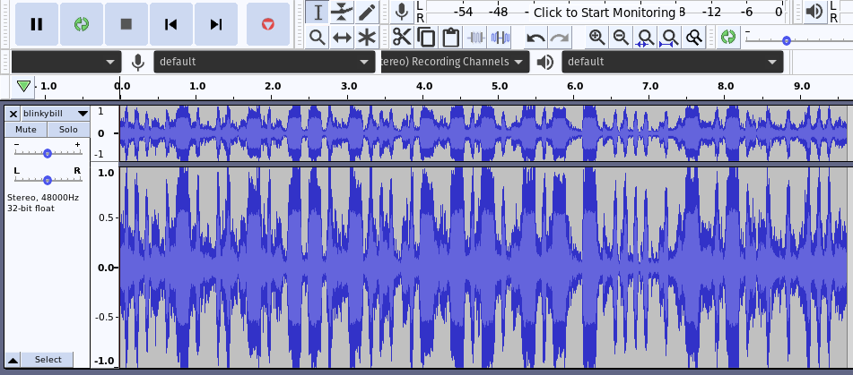
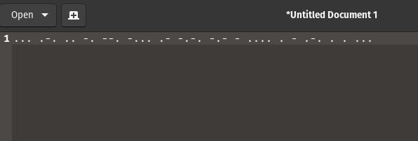
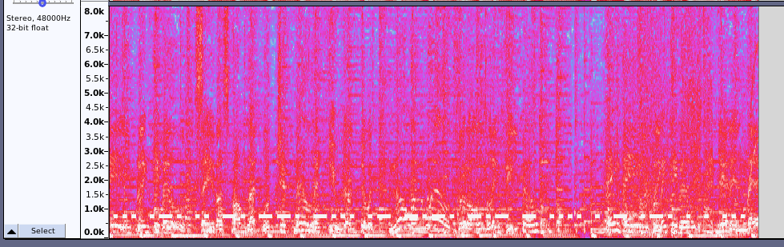

## DUCTF'23: BlinkyBIll

This was a morse code steganography challenge which had a challenge file of around 10s. The challenge file can be downloaded
[here](https://github.com/DownUnderCTF/Challenges_2023_Public/blob/main/beginner/blinky-bill/publish/blinkybill.wav).

## The Challenge

The audio file was 10s long, with beeps of varying lengths. There were background noises in the audio too. The goal was to decrypt the hidden message within the audio file. 

## Solution

The beeps gave it away that it was morse code. I put the wav file into Audacity, a free audio software. The waveform of the audio file is shown below: 



Looking at the waveform, I could see that there were two different lengths of beeps, which corresponded to dots and dashes in morse code. Looking at the waveforms, I typed out the matching dots and dashes into a text editor and my result was as shown:



Next, I searched up a [morse code translator](https://morsedecoder.com/). Putting the morse code into the translater gave me the result of:

```
SRINGBACKTHETREES
```

I guess the audio was cut off at the front, so it was missing one dot/dash. `...` or `S` for the first character could be changed to `-...` or `B` for the flag to make more sense.

This gives us the flag as `DUCTF{BRINGBACKTHETREES}`

## Alternative Solution

Additionally, reading others' writeups, I realised that there was actually a simpler way.

Viewing the same file on Audacity but toggling to view the spectrogram instead, gives this: 



The morse code can also be seen at the bottom, which would have saved some time for me :") 