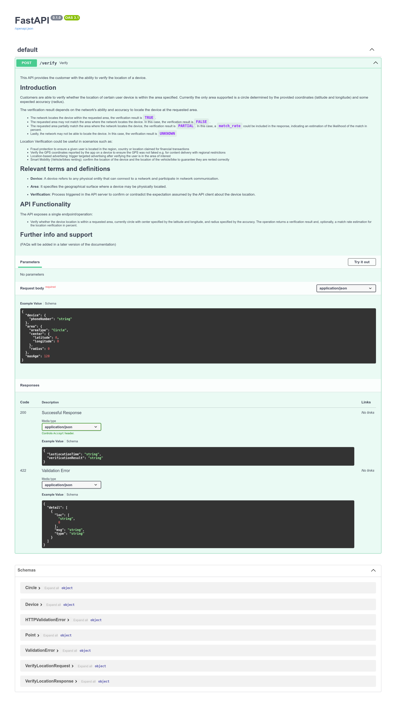
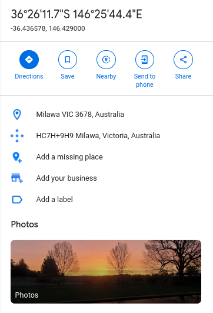

## DUCTF'23: Faraday

This was a pretty interesting OSINT challenge which made use of GSMA's Location API, to determine a target's location using their phone number. It verifies if the device location is within a requested area based on their network activity (cell tower triangulation, GPS and Wi-Fi hotspot data)

## The Challenge

```
faraday | 100 | medium | 359 Solves

We've been trying to follow our target Faraday but we don't know where he is.

All we know is that he's somewhere in Victoria and his phone number is +61491578888.

Luckily, we have early access to the GSMA's new location API. Let's see what we can do with this.

The flag is the name of the Victorian town our target is in, in all lowercase with no spaces, surrounded by DUCTF{}. For example, if Faraday was in Swan Hill, the solution would be DUCTF{swanhill}.

Author: hashkitten

https://osint-faraday-9e36cbd6acad.2023.ductf.dev/docs
```

The link leads to a RESTful API site. Toggling POST, we are greeted by this:



## Explanation

To pinpoint the target's location, we had to make queries to the API using Faraday's phone number, location, and the radius. 

## Solution

Clicking on `try it out` on FastAPI, I was able to send the POST requests directly on the website. The initial (default) request body is:

```JSON
{
  "device": {
    "phoneNumber": "string"
  },
  "area": {
    "areaType": "Circle",
    "center": {
      "latitude": 0,
      "longitude": 0
    },
    "radius": 0
  },
  "maxAge": 120
}
```

The first thing I did was to input Faraday's phone number, `+61491578888` into the phoneNumber field. I then used Google Maps to zoom into Victoria. I clicked into the middle of it to retrieve the latitude and longitude of it, inputting into the request. Additionally, I used the largest possible radius allowed to check if I was on track.

```JSON
{
  "device": {
    "phoneNumber": "+61491578888"
  },
  "area": {
    "areaType": "Circle",
    "center": {
      "latitude": -36.99568,
      "longitude": 143.94140
    },
    "radius": 200000
  },
  "maxAge": 120
}
```

Unfortunately, my result was `FALSE`.
```JSON
{
  "lastLocationTime": null,
  "verificationResult": "FALSE"
}
```

Knowing that it was not within 200km of the centre of Victoria, I used Google Map's `measure distance` feature to go around 200km East.

```JSON
{
  "device": {
    "phoneNumber": "+61491578888"
  },
  "area": {
    "areaType": "Circle",
    "center": {
      "latitude": -37.03657804374402,
      "longitude": 146.34366
    },
    "radius": 200000
  },
  "maxAge": 120
}
```

And I got a true!
```JSON
{
  "lastLocationTime": "Fri Sep  8 09:30:54 2023",
  "verificationResult": "TRUE"
}
```

Knowing that the point is within 200km of this point, I reduced the radius until I got a `FALSE` with this coordinates. At around the radius of 40km, it returned false. Which is a good thing! It means that the location is around 50km of that point. I then moved around by changing the coordinates, using trial and error to find the point. Eventually, I got to a really close one:

```JSON
{
  "device": {
    "phoneNumber": "+61491578888"
  },
  "area": {
    "areaType": "Circle",
    "center": {
      "latitude": -36.43657804374402,
      "longitude": 146.429
    },
    "radius": 10000
  },
  "maxAge": 120
}
```JSON
{
  "lastLocationTime": "Fri Sep  8 09:34:49 2023",
  "verificationResult": "TRUE"
}
```

Typing the coordinates into Google Maps, I got this:



Which gave us our flag, `DUCTF{Milawa}` !