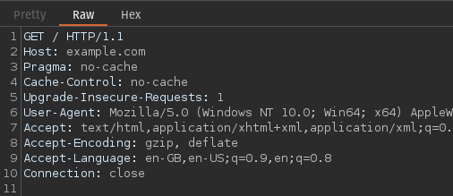
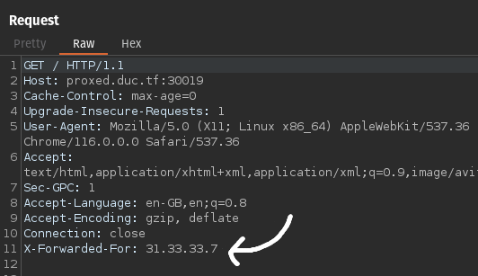
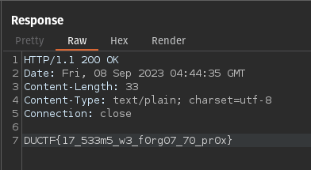

# DuCTF'23: Proxed

This challenge is solved by changing a specific HTTP header to
a hardcoded value.

If we look at the source code, we can see that the flag is returned when the
variable `ip` matches `31.33.33.7`.

```go
if ip != "31.33.33.7" {
    message := fmt.Sprintf("untrusted IP: %s", ip)
    http.Error(w, message, http.StatusForbidden)
    return
} else {
    w.Write([]byte(os.Getenv("FLAG")))
}
```

So where does this variable `ip` come from? If we look
at the start of the function, we see the following lines of code.

```go
http.HandleFunc("/", func(w http.ResponseWriter, r *http.Request) {
    xff := r.Header.Values("X-Forwarded-For")
    ip := strings.Split(r.RemoteAddr, ":")[0]
    // ...
})
```

Well, it seems like the variable is directly extracted from the
[`X-Forwarded-For` HTTP header](https://developer.mozilla.org/en-US/docs/Web/HTTP/Headers/X-Forwarded-For).
If you're interested, you can read up more on them [here](https://developer.mozilla.org/en-US/docs/Web/HTTP/Headers)!

## Getting the Flag

If the HTTP header contains `X-Forwarded-For`, the variable `ip`
will be set to the value after the colon. A regular HTTP request
looks like this, where there are multiple headers that are
in a key-value pair seperated by colons.



Hence, we can simply add one more header named `X-Forwarded-For`
with the value of `31.33.33.7` and the server will return us
the flag!





Flag: `DUCTF{17_533m5_w3_f0rg07_70_pr0x}`
