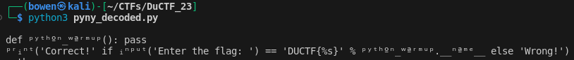

## DUCTF'23: Pyny

This reverse engineering challenge from DuCTF 2023 was rather intresting as it
played around with encodings, which is not commonly (to me at least) changed.

## The Code

```py
#coding: punycode
def _(): pass
('Correct!' if ('Enter the flag: ') == 'DUCTF{%s}' % _.____ else 'Wrong!')-gdd7dd23l3by980a4baunja1d4ukc3a3e39172b4sagce87ciajq2bi5atq4b9b3a3cy0gqa9019gtar0ck
```

## Explanation

At first glance, the seemingly random characters at the end seem to be invalid
Python code. However, if we look at the comment at the top, it states that it
some sort of encoding called `punycode`.

Initially, I assumed this had no significant effect on the code as it was a
comment. However, a quick look through Python's documentation reveals this.

> If a comment in the first or second line of the Python script matches the
> regular expression coding[=:]\s*([-\w.]+), this comment is processed as an
> encoding declaration; the first group of this expression names the encoding
> of the source code file. The encoding declaration must appear on a line of
> its own. If it is the second line, the first line must also be a comment-only line.

This means that in the first two lines, if any comment matches the regex above,
Python will decode the rest of the program using the specified encoding.

Thus, in this case, Python decodes the program as punycode before running it.

## Solution

So, how can we decode punycode into human-readable text? Well,
my solution was rather hacky. I first turned the entire code
into a multi-line string, encoded it as `UTF-8` and decoded it
as `punycode`.

```py
code = """#coding: punycode
def _(): pass
('Correct!' if ('Enter the flag: ') == 'DUCTF{%s}' % _.____ else 'Wrong!')-gdd7dd23l3by980a4baunja1d4ukc3a3e39172b4sagce87ciajq2bi5atq4b9b3a3cy0gqa9019gtar0ck"""

print(code.encode("utf-8").decode("punycode"))
```

The output of the code will reveal that the seemingly unnamed `def _(): pass`
function is called `python_warmup`, and the if statement contains hidden characters!



We can infer from this that the flag is the name of `python_warmup`,
which gives us `DUCTF{python_warmup}`
