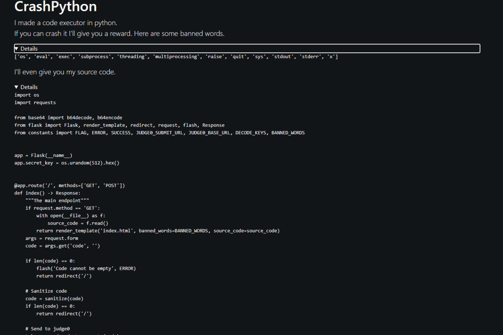
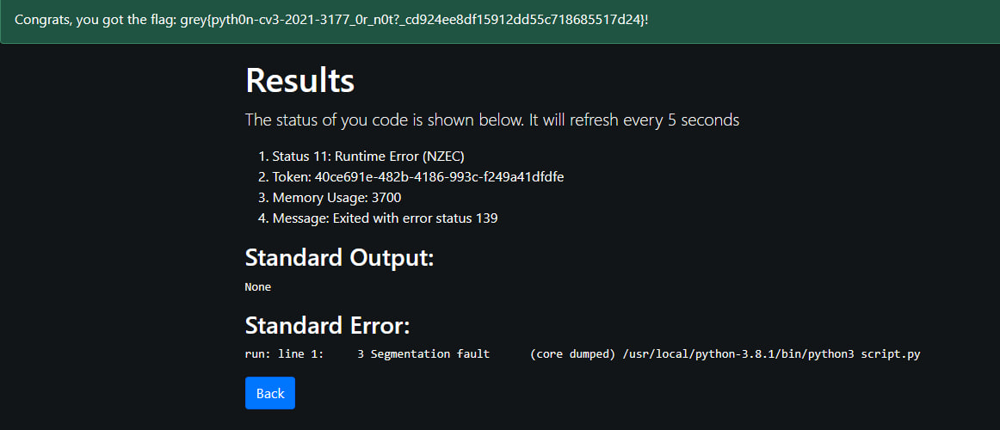

## GreyCTF'23: CrashPython

This was a pretty simple python challenge that makes use of a segmentation fault (segfault). A segfault occurs when a program tries to access a memory location that it is not allowed to access.

## The Challenge



## Explanation

The main gist of this challenge was that there was a placeholder to input python code to run to cause a crash (through segmentation fault), but the code had to fulfil the requirements of the blacklist. The blacklist included keywords that couldn't be used in the code.

## Solution

With the restrictions, how can we still cause a segfault? I read up more about segfaults in python and found this.

> In Python, segmentation faults can occur when using C extensions, which allow Python to interact with native libraries and code. These extensions can be written in C or C++ and can provide significant performance benefits to Python programs. However, if these extensions are poorly written or contain bugs, they can cause segmentation faults.

One of the libraries that provide C compatible data types in Python is `ctypes`, hence I tried to utilise this library. 

```py
import ctypes
def segfault():
    # Access an invalid memory location
    ctypes.string_at(0)

segfault()
```

This code attempts to read a string from memory address 0, which is typically off-limits for user-level programs for security reasons. Thus, the operating system intervenes to prevent any unintended consequences, leading to a segfault. 

And that worked! Giving us the flag:

