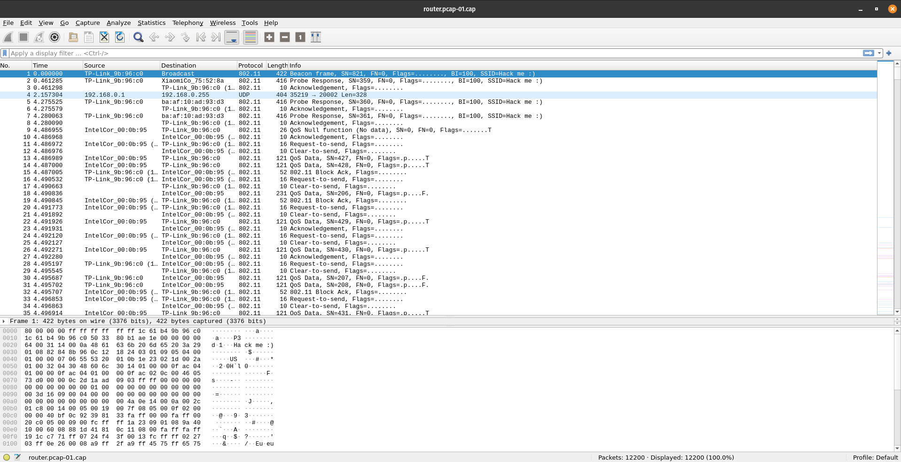
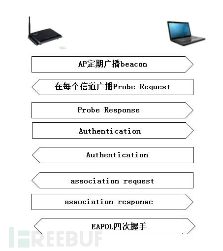
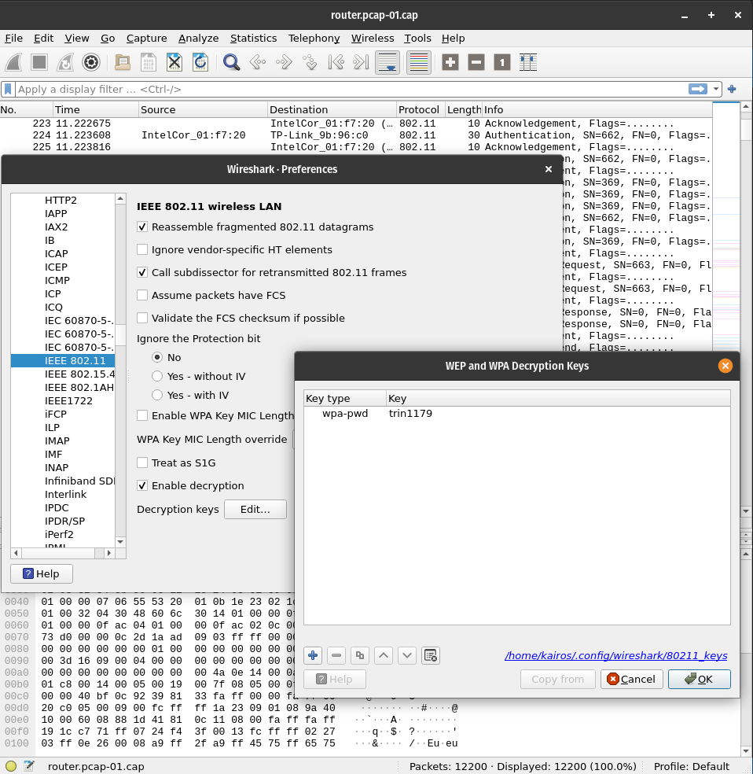
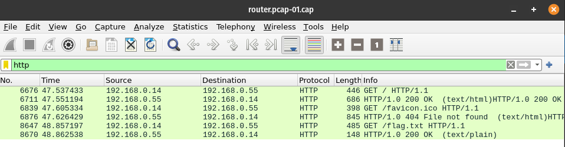
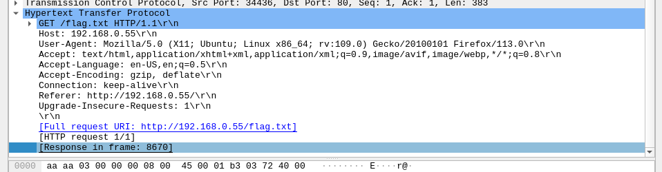
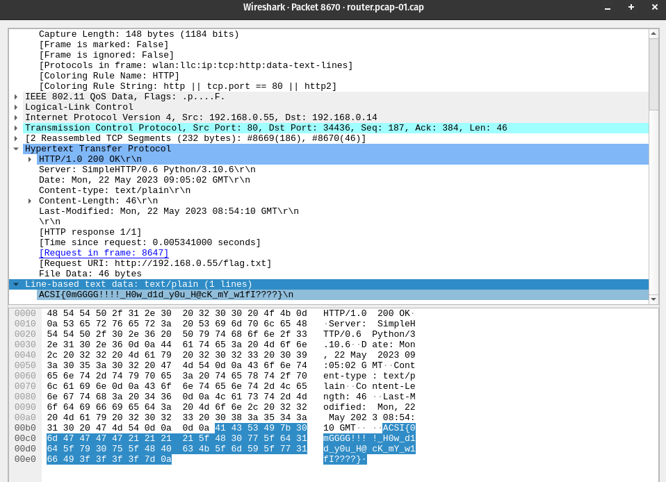

## Hack@AC'24: HackMe:)

This was a forensics challenge that provided a WireShark capture of wifi traffic. The challenge was to find the flag from the [capture](router.pcap-01.cap) via wifi hacking.

```txt
Hack me :)
by sawntoe
Hack me if you can :)
11 Solves | 1000 Points
```

## The Challenge

Opening the file in Wireshark, we can see that there a huge number of packets - 12,200 to be exact. It'll be quite a hassle to go through all of them at this point, so we should probably analyse the whole situation first.



The traffic seemed to be between a TP-Link router, an IntelCor device and a Xiaomi device.

## Cracking the Password

Usually when given a Wireshark capture of wifi traffic, the first thing that comes to mind would be using Aircrack-ng to crack the password, given that the capture contains a handshake.

With reference to the image of the WPA Authentication Handshake below:



I could derive that there indeed was a handshake in the capture after scrolling through the packets. So, I could use Aircrack-ng to crack the password. I used [rockyou.txt](https://www.google.com/url?sa=t&rct=j&q=&esrc=s&source=web&cd=&cad=rja&uact=8&ved=2ahUKEwi_g8eUjcSEAxURoGMGHW89C_YQFnoECAYQAQ&url=https%3A%2F%2Fgithub.com%2Fbrannondorsey%2Fnaive-hashcat%2Freleases%2Fdownload%2Fdata%2Frockyou.txt&usg=AOvVaw3snAERl1mU6Ccr4WFEazBd&opi=89978449) as the wordlist.

```bash
kairos@pop-os:~/Downloads$ aircrack-ng router.pcap-01.cap -w ~/Documents/Tools/wordlist/rockyou.txt
```

After running it for a bit, the password was cracked.

```bash
                               Aircrack-ng 1.6 

      [00:01:31] 3206929/14344391 keys tested (35662.40 k/s) 

      Time left: 5 minutes, 12 seconds                          22.36%

                           KEY FOUND! [ trin1179 ]


      Master Key     : 47 3A 6A 0D 28 87 EB C5 3C 04 1F 22 6D FC 07 59 
                       C3 5A 4F F9 2C 5D B0 1F 8D BC B3 5F D2 54 F4 03 

      Transient Key  : 00 00 00 00 00 00 00 00 00 00 00 00 00 00 00 00 
                       00 00 00 00 00 00 00 00 00 00 00 00 00 00 00 00 
                       00 00 00 00 00 00 00 00 00 00 00 00 00 00 00 00 
                       00 00 00 00 00 00 00 00 00 00 00 00 00 00 00 00 

      EAPOL HMAC     : 31 E4 B8 96 75 29 95 7F 5E 17 A1 C2 98 74 D8 F7 
```

## Decrypting the Traffic

Now that we have the password, we can see the decrypted traffic. Wireshark has a neat feature that allows us to decrypt the traffic using the password.



To reach that screen, we have to go to `Edit` > `Preferences` > `Protocols` > `IEEE 802.11` and enter the password in the `Decryption keys` section.

Now, the decrypted traffic can be seen. Simple right?

## Getting the Flag

Now comes the slightly mind-boggling part. We have so many packets, what do we filter for?

There are a bunch of protocols here - 802.11, UDP, ARP, ICMP, HTTP, and so on. While we do have the decrypted traffic, some of the packets are still encrypted due to the nature of the protocol, like HTTPS. So we probably can't get a flag from that.

Thus, we should look for something that we don't need to decrypt - like HTTP.



Upon filtering for HTTP, we can see that there are only 6 packets, and within it is a GET request to `/flag.txt`. 

If we were to look at the packet details of the GET request, we can see which packet contains the response.



Navigating to that packet:


 
We get the flag!
