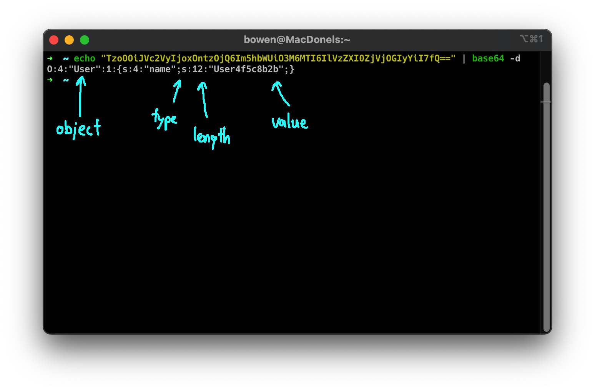
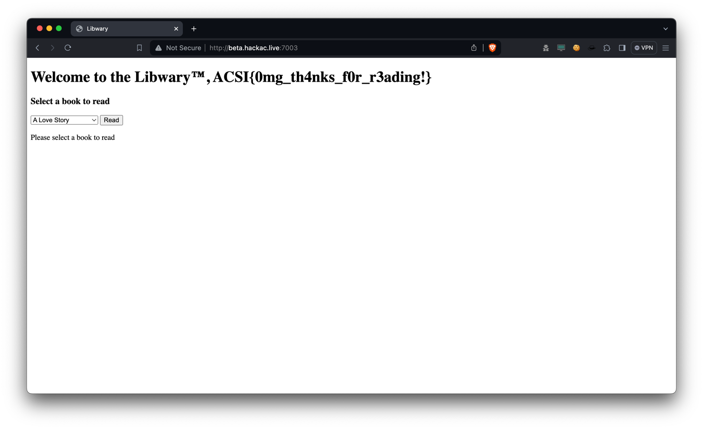

# Libwary

This was an interesting PHP challenge showcasing the potential
impacts of insecure deserialization.

## Description

> Try to read the flag from The Libwary. (Impossible)

The source code for this challenge can be found [here](libwary.zip).

---

## Spotting the Vulnerability

When looking at `index.php`, we see that our `user` object is deserialized
from the `PHPSESSID` cookie. Deserializing user input is **always** a huge no-no,
as users can send specially crafted payload to pwn the server.

```php
if (!isset($_COOKIE['PHPSESSID'])){
    $user = new User("User". substr(uniqid(),5,9));
    setcookie("PHPSESSID", base64_encode(serialize($user)));
}
else{
    $user = unserialize(base64_decode($_COOKIE['PHPSESSID']));  // Here!
}
```

In this case, the `User` class is being serialized, converted to base64,
and saved to the `PHPSESSID` cookie. The server will then deserialize it
when the user makes the request again.

## What is Serialization and Deserialization?

When we create objects (or classes) during a program's runtime, it is
represented as binary directly inside the program's memory. Once
the program ends, the object ceases to exist.
Some programs require the state of the objects to be
preserved even after the program ends. This is where serialization
and deserialization comes in handy. It allows objects to be
saved in a structured format on our hard disks.

For example, we have a book object in Python, and we would like to
save it:

```py
class Book:
    def __init__(self, option, name, content):
        self.option = option
        self.name = name
        self.content = content

book = Book(1, "Harry Potter and the Philosopher's Stone", "...")
serializer.to_json(book)  # Imaginary serializer class
```

A serializer could convert this into JSON (or any other format) and save it like this:

```json
{
    "option": 1,
    "name": "Harry Potter and the Philosopher's Stone",
    "content": "..."
}
```

This is a rather simple way to serialize and lacks a decent number of features,
such as saving functions and custom data types. If you'd like to find out more,
Python has an amazing library for serialization and deserialization
called [pickle](https://docs.python.org/3/library/pickle.html),
and [this guide](https://realpython.com/python-pickle-module/) explains how to use it.

## Serialization & Deserialization in PHP

PHP stores the objects in a JSON-like format like `{type:length:value}`.
Do refer to the [PHP serialization documentation](https://www.php.net/manual/en/function.serialize.php)
for a more detailed explanation.



## Exploiting this Vulnerability

So how can we use this to our advantage? In the image above, we see that we have
control over the `object` property. Thus, we can modify this to be a `Book` instead
of a `User`, with a property `name` containing `flag.txt`!

```PHP
class Book {
    // ...
    function __tostring(){
        //final defence
        if ($this->name != "fakeflag.txt") $this->name = str_ireplace("flag", "", $this->name);
        //read the file
        $this->content = file_get_contents("books/" . $this->name);
        //make it look nicer
        $this->content = str_replace("\r", "", $this->content);
        $this->content = str_replace("\n", "<br>", $this->content);

        return $this->content;
    }
    // ...
}
```

However, there's a catch. We see that in the `__tostring` function of `Book`, there
is a filter that replaces `flag` with an empty string. Thankfully, there's a trivial way to
overcome this filter by using the payload `flflagag.txt`. Since this function
is not recursive, it only removes a single occurrence of `flag`. We can wrap this within
another `flag` string, and after it runs through the filter, we would be left with `flag.txt`!

We can modify the cookie to be a `Book` with name `flflagaag.txt` using
this command, and setting it with inspect element:

```Console
$ echo "O:4:\"Book\":1:{s:4:\"name\";s:12:\"flflagag.txt\";}" | base64
Tzo0OiJCb29rIjoxOntzOjQ6Im5hbWUiO3M6MTI6ImZsZmxhZ2FnLnR4dCI7fQo=
```


