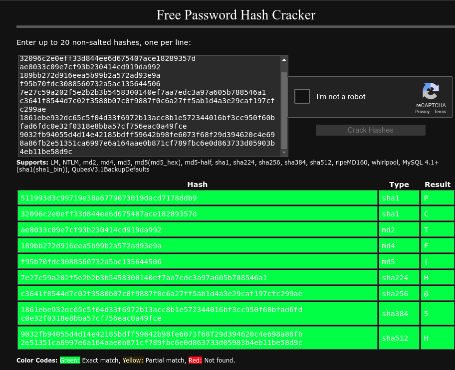

## Patriot CTF: Breakfast club

This was a cryptography challenge focused on hash cracking. The challenge involved various hashing algorithms, and each character in the flag was hashed using a different algorithm. The objective was to crack the hash for each algorithm to retrieve the flag.

## The Challenge

```
As the sysadmin for your college, you're responsible for overseeing the security of all the clubs. One of the on campus orginizations is a breakfast club with their own personal website that the leader assured you was "unhackable". He was so sure of this, that he sent you an example of how hashes are stored in the database, something about "changing the hash type multiple times for each password" or something like that. Can you crack the password and prove him wrong?
```

Text file:

```
SHA 511993d3c99719e38a6779073019dacd7178ddb9
SHA1 32096c2e0eff33d844ee6d675407ace18289357d
MD2 ae8033c09e7cf93b230414cd919da992
MD4 189bb272d916eea5b99b2a572ad93e9a
MD5 f95b70fdc3088560732a5ac135644506
SHA224 7e27c59a202f5e2b2b3b5458300140ef7aa7edc3a97a605b788546a1
SHA256 c3641f8544d7c02f3580b07c0f9887f0c6a27ff5ab1d4a3e29caf197cfc299ae
SHA384 1861ebe932dc65c5f04d33f6972b13acc8b1e572344016bf3cc950f60bfad6fdc0e32f0318e8bba57cf756eac0a49fce
SHA512 9032fb94055d4d14e42185bdff59642b98fe6073f68f29d394620c4e698a86fb2e51351ca6997e6a164aae0b871cf789fbc6e0d863733d05903b4eb11be58d9c
SHA3_224 d22e03747b83667e3e84c78e9fb49f7c9376334b9cb337addbdf3ff9
SHA3_256 d14a329a1924592faf2d4ba6dc727d59af6afae983a0c208bf980237b63a5a6a
SHA3_384 3bd4e7dcad9d3c02adfa7aa5388727d346278a9a7b007f497b48a4fa2a12b9545c820df150854a8f8c494275bd6fd941
SHA3_512 2d44da53f305ab94b6365837b9803627ab098c41a6013694f9b468bccb9c13e95b3900365eb58924de7158a54467e984efcfdabdbcc9af9a940d49c51455b04c
TupleHash128 aed477850ed48df54054e9d3e7b8cae7e1764d949adb68fe4f24802ec464cb6c334ef97cc0453471fac5faf0118265bc9388062ccb704d5ac4010489bee201da
TupleHash256 a130e4df9144790d9c8824f90f4c1220a3eb5aa0cb296ab1f4f41f23f3ed0800f2ac3fad4f235a4ee601a8ca8bf0be394e06e53e2f789a6272f1bc54c4901d0c
BLAKE2s 5abf6b1a79dee98ea32a98195c61a667c29a3674e79c82e43f0d19b0efa4b6f7
BLAKE2b 7ae26253cfd42a3a090c44023c234ec63d0ffe63f8ad40b7913f3f646503b7a7cb8ac571d42a311ef71508344de72f30b57e5c100b402130060ebc947e07a59b
```

## Solution Part 1 - Common Hash Algorithms

For the first few, more common hashing algorithms, I used a website called [CrackStation](https://crackstation.net/).



It was able to crack the hashes up till SHA512, which was plenty. So what I had now was `PCTF{H@5H` and of course, ending with `}` since it started with the flag format. 

## Solution Part 2 - SHA3_X Algorithms

Moving on, I had to crack the SHA3_X algorithms. I couldn't find any working hashcrackers for these algorithms, so I used a python script to do so. 

It iterated through different combinations of `characters` and the hash types, comparing the generated hash with the target hash for each algorithm. When a match was found, it would then print the character. 

```python
import hashlib
import itertools

characters = "abcdefghijklmnopqrstuvwxyzABCDEFGHIJKLMNOPQRSTUVWXYZ0123456789!@#$%^&*()_+[]{}|;':\",.<>?/\\"

target_hashes = {
    "SHA3_224": "d22e03747b83667e3e84c78e9fb49f7c9376334b9cb337addbdf3ff9",
    "SHA3_256": "d14a329a1924592faf2d4ba6dc727d59af6afae983a0c208bf980237b63a5a6a",
    "SHA3_384": "3bd4e7dcad9d3c02adfa7aa5388727d346278a9a7b007f497b48a4fa2a12b9545c820df150854a8f8c494275bd6fd941",
    "SHA3_512": "2d44da53f305ab94b6365837b9803627ab098c41a6013694f9b468bccb9c13e95b3900365eb58924de7158a54467e984efcfdabdbcc9af9a940d49c51455b04c",
}

hash_functions = {
    "SHA3_224": hashlib.sha3_224,
    "SHA3_256": hashlib.sha3_256,
    "SHA3_384": hashlib.sha3_384,
    "SHA3_512": hashlib.sha3_512,
}

def check_hash(data, target_hash, hash_func):
    hash_value = hash_func(data.encode()).hexdigest()
    if hash_value == target_hash:
        return True
    return False

for length in range(1, 6): 
    for combination in itertools.product(characters, repeat=length):
        data = ''.join(combination)
        for hash_type, target_hash in target_hashes.items():
            if check_hash(data, target_hash, hash_functions[hash_type]):
                print(f"Match found for {hash_type}: {data}")
```

The output I got was this:
```
Match found for SHA3_384: R
Match found for SHA3_512: 0
Match found for SHA3_256: 8
Match found for SHA3_224: _
```

Matching it back to the order of the password, now we had `PCTF{H@5H_8R0` and `}`.

## Solution Part 3 - TupleHash Algorithms

Next was the tuplehash algorithms. This was slightly more tricky, given that I have never seen these algorithms before. I searched these algorithms up, and luckily, there was also a Python library for this hash algorithm. 

For TupleHash128, I made this script (with reference to the [docs](https://pycryptodome.readthedocs.io/en/latest/src/hash/tuplehash256.html)) which is similar to the above script which also iterates through the characters.

```python
from Crypto.Hash import TupleHash128

target_hash = "aed477850ed48df54054e9d3e7b8cae7e1764d949adb68fe4f24802ec464cb6c334ef97cc0453471fac5faf0118265bc9388062ccb704d5ac4010489bee201da"

def check_hash(input_char):
    hd = TupleHash128.new(digest_bytes=32)  
    hd.update(input_char.encode())
    hash_value = hd.hexdigest()
    return hash_value == target_hash

characters_to_check = "abcdefghijklmnopqrstuvwxyzABCDEFGHIJKLMNOPQRSTUVWXYZ0123456789!@#$%^&*()_+[]{}|;':\",.<>?/\\"

for char in characters_to_check:
    if check_hash(char):
        print(f"Match found for character: {char}")
        break
else:
    print("No match found for any character.")

```

Initially, I couldn't get any matches. Reading more into the documentations, I tried changing the `digest_bytes` value and eventually managed to crack the hash for this character.

```
Match found for character: W
```

For TupleHash256, I also used the same script, just changing the target hash and the hash algorithm to `TupleHash256`. The digest_bytes value that I had to use was too, `64`. This gave the next character:

```
Match found for character: N
```

Alright, now we have `PCTF{H@5H_8R0WN` and `}`. And now we had one last character to crack!

## Solution Part 3 - Blake Algorithms

Again, this was an unfamiliar hashing algorithm, and I had to search up how to crack this hash. Once again, I used a similar script, this time using the `cryptography` library.

```py
from cryptography.hazmat.backends import default_backend
from cryptography.hazmat.primitives import hashes

target_hash = "5abf6b1a79dee98ea32a98195c61a667c29a3674e79c82e43f0d19b0efa4b6f7"

characters_to_check = "abcdefghijklmnopqrstuvwxyzABCDEFGHIJKLMNOPQRSTUVWXYZ0123456789!@#$%^&*()_+[]{}|;':\",.<>?/\\"

for char in characters_to_check:
    digest = hashes.Hash(hashes.BLAKE2s(32), backend=default_backend())
    digest.update(char.encode())

    hash_value = digest.finalize()

    if hash_value.hex() == target_hash:
        print(f"Match found for BLAKE2s: {char}")

```

And finally, I got the last character which was `S`! So now we had the full flag, `PCTF{H@5H_8R0WNS}` :D