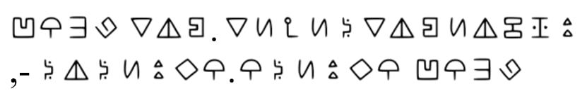
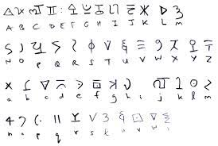
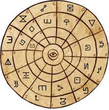
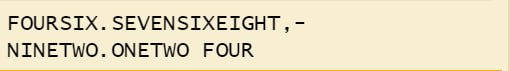
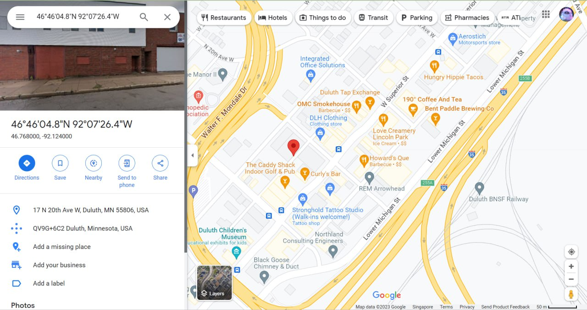

## Patriot CTF: My phone!

This was a simple Crypto challenge where we had to figure out the location of a phone thief, that was encrypted by a odd cipher.

## The Challenge

```
Some weird triangle man stole my phone, he taunted me by sending me his location but it seems to be encrypted with some odd cipher I've never seen before, could you please help me get my phone back?
```

 

## Solution

I first just searched up symbol ciphers but I was  confused between Blitz Cipher and Bill’s Cipher as they both look kind of familiar. 






After thoroughly looking through the ciphertext and what was stated in the challenge. I realised that the location was encrypted using Bill’s Cipher and that is because in Gravity Falls a triangular shaped demon is named Bill Cipher. 

With the help of a online decoder website called [dCode](https://www.dcode.fr/en) I was able to decrypt the ciphertext and the plaintext is shown below:



They look like coordinates right? Yes, so I just typed them inside google maps and got the name of the city where the phone thief was in. 



`Flag: PCTF{Duluth}`