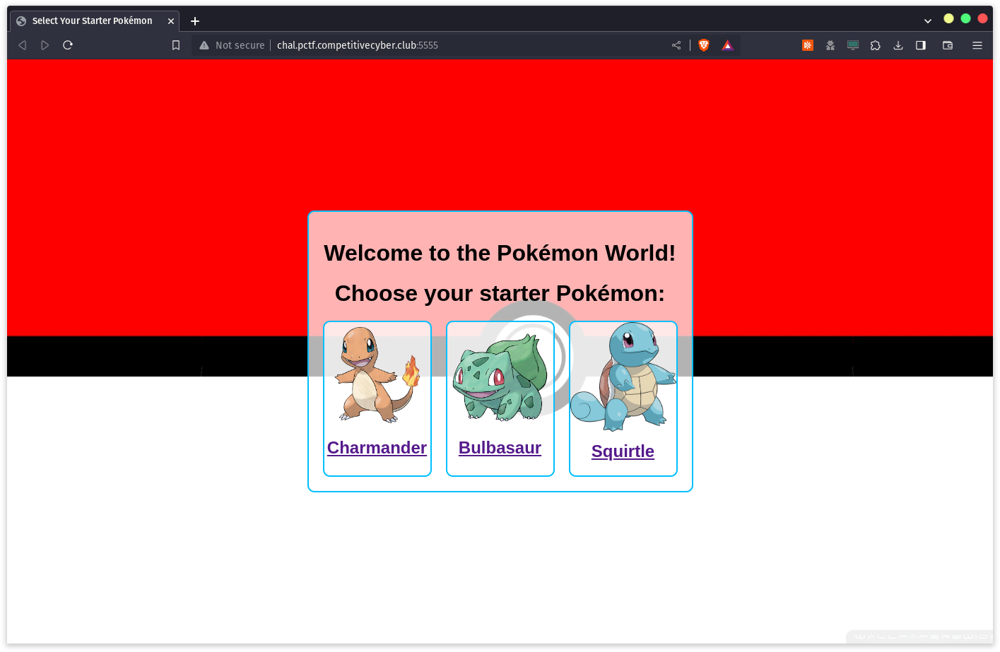
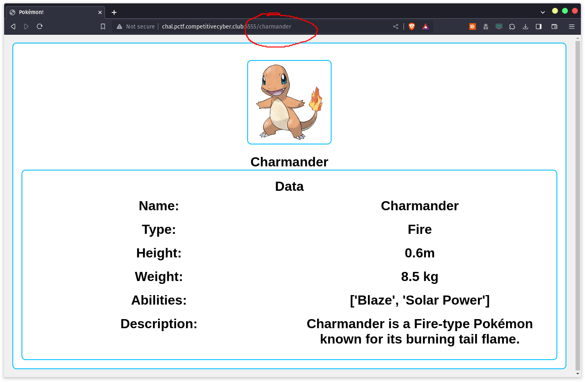
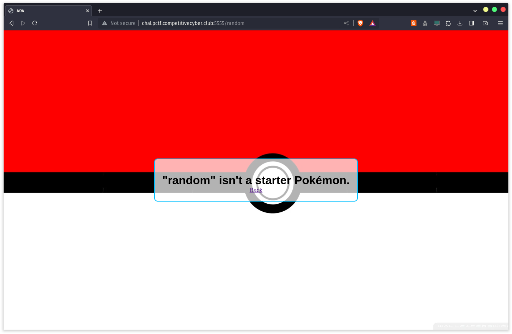
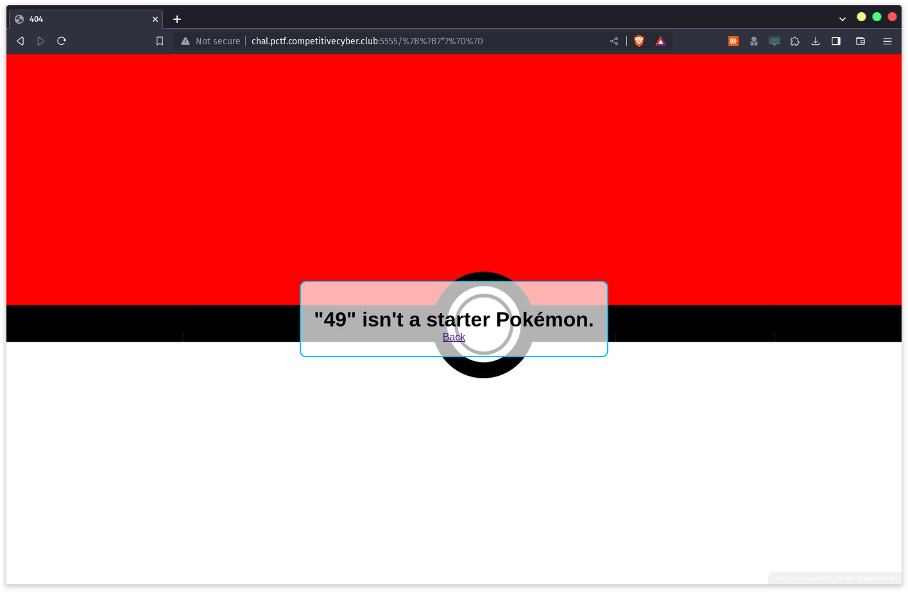
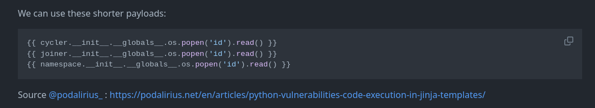
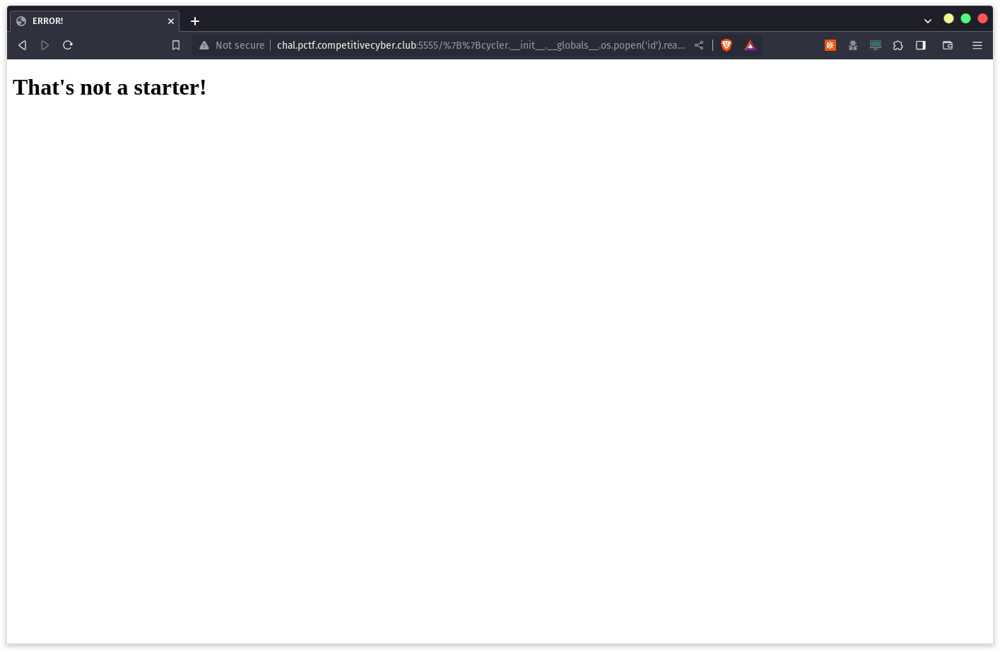
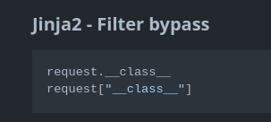
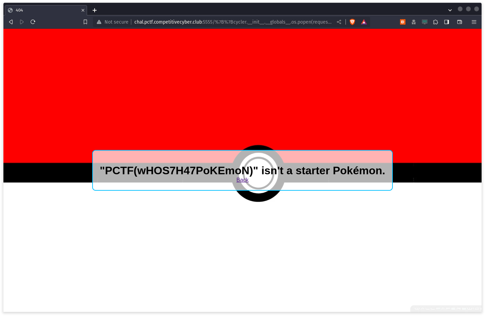

# Pick Your Starter

This was a web challenge that involves the use of exploiting Jinja2 SSTI and navigating around filters to gain remote code execution to read the flag.

## Description

> Picking a starter is hard, I hope you can do it.

---

## Overview

When we go to the site, we are greeted with pictures of the 3 starter pokemons, and when we click on them, we are redirected to `/{pokemon name}`.




What happens when we try putting other inputs inside?



Well, nothing intresting... So how can we progress on from here?

---

## Server Side Template Injection (SSTI)

This challege runs a [Flask](https://en.wikipedia.org/wiki/Flask_(web_framework)) server to serve the webpages (we'll explain how we found out that it runs Flask soon). Flask uses a templating engine called [Jinja](https://en.wikipedia.org/wiki/Jinja_(template_engine)) to render out HTML. A templating engine evaluates statements within a HTML file and replaces it with the actual content. An example would be the following:

```py
def serve_article():
    title = "Pokemon Writeup"
    content = "..."
    author = "John"

    return """
    <article>
        <h2>{{ title }}</h2>
        <p>{{ content }}</p>
        <p>By {{ author }}</p>
    </article>
    """
```

If we visit the webpage that is rendered after `serve_article` is called, we will see that instead of `{{ title }}`, it will be replaced with `Pokemon Writeup`, which is the value of the variable `title`. In general, anything within the 2 curly braces `{{ }}` will be evaluated as code.

If user input is allowed to be evaluated on the server without any sort of input sanitisation, users can craft malicious payloads that will be executed by the server. This challenge exploits this vulnerability to read the flag.

---

## SSTI in Action

Now that we know what this challenge is vulnerable to, how can we exploit it? Lets first detect which templating engine this server is running using this handy chart from [PayloadsAllTheThings](https://github.com/swisskyrepo/PayloadsAllTheThings/tree/master) below:


When we pass `{{ 7 * 7 }}` as the Pokemon name, we see that instead of getting `"7 * 7" is not a Pokemon`, we instead get the value of what `7 * 7` evaluates to, which is `49`. According to the flowchart, this means that the server is either running `Twig` or `Jinja2`. However, due to some filters that are present on the server, we are not able to send the payload `{{ 7 * '7' }}`, and have to resort to guessing the templating engine.



## Exploitation

So how can we use this code execution vulnerability to read files? Well, [PayloadsAllTheThings](https://github.com/swisskyrepo/PayloadsAllTheThings/tree/master) contain a variety of payloads for different sorts of vulnerabilites, including SSTI.

After much trial and error, I discovered that there were multiple blacklisted characters, namely `"`, `'`, `+` and `[]`. I'm sure there are much more blacklisted characters, but that was all that I could find so far.

With the help of PayloadsAllTheThings, I managed to find a input which will allow us to execute commands and read files: `cycler.__init__.__globals__.os.popen('id').read()`.



Yay! We are done, right? Unfortunately, no 😭



As mentioned before, the server blacklists certain characters, including `'` and spaces. So how can we bypass this?

## Bypassing Filters

Through much trail and error, I discovered that the filters are only applied to the SSTI payload, and we can pass extra arguments without being affected by the blacklist. An example would be the following:

`/{{ SSTI_PAYLOAD }}?param1=custom unfiltered payload`

We also have access to the [request](https://tedboy.github.io/flask/generated/generated/flask.Request.html) class from Flask, which stores all of the data related to the request made, including our custom parameters. Thus, we would be able to access our custom unfiltered payload using `request.args.param1`.



By chaining the above, we can call `popen` with the custom parameters and use that to read the flag!

`http://chal.pctf.competitivecyber.club:5555/{{cycler.__init__.__globals__.os.popen(request.args.p).read()}}?p=cat /flag.txt`


