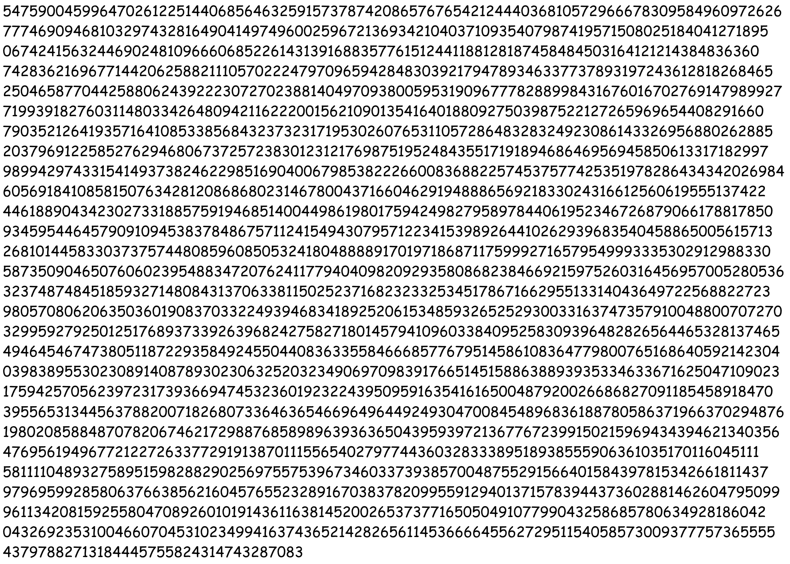

## Patriot CTF: ReReCaptcha

This was an RSA challenge which required the use of OCR (Optical character recognition - converting an image of text into text format).

## The Challenge

The challenge had a zip file containing four images:

CT.png:



E.png:


P.png:


Q.png:


In RSA (and here),

- `CT` - Ciphertext / Encrypted Message
- `E` - Public Exponent (Part of Public Key) that is relatively prime (share no common factors other than 1) to the product of `P-1` and `Q-1` which is represented by `phi`
- `P` and `Q` - (Part of private key) Distinct, large prime numbers used in the generation of the RSA key pair.

## Retrieving Values

To retrieve the values from the image, what we had to do was to use OCR to get the values from the image. I used a free [OCR](https://www.onlineocr.net/) tool and uploaded the files.

The results were as such:

```
CT: 547590045996470261225144068564632591573787420865767654212444036810572966678309584960972626 777469094681032974328164904149749600259672136934210403710935407987419571508025184041271895 067424156324469024810966606852261431391688357761512441188128187458484503164121214384836360 742836216967714420625882111057022247970965942848303921794789346337737893197243612818268465 250465877044258806243922230727023881404970938005953190967778288998431676016702769147989927 719939182760311480334264809421162220015621090135416401880927503987522127265969654408291660 790352126419357164108533856843237323171953026076531105728648328324923086143326956880262885 203796912258527629468067372572383012312176987519524843551719189468646956945850613317182997 989942974331541493738246229851690400679853822266008368822574537577425351978286434342026984 605691841085815076342812086868023146780043716604629194888656921833024316612560619555137422 446188904342302733188575919468514004498619801759424982795897844061952346726879066178817850 934595446457909109453837848675711241549430795712234153989264410262939683540458865005615713 268101445833037375744808596085053241804888891701971868711759992716579549993335302912988330 587350904650760602395488347207624117794040982092935808682384669215975260316456957005280536 323748748451859327148084313706338115025237168232332534517867166295513314043649722568822723 980570806206350360190837033224939468341892520615348593265252930033163747357910048800707270 329959279250125176893733926396824275827180145794109603384095258309396482826564465328137465 494645467473805118722935849245504408363355846668577679514586108364779800765168640592142304 039838955302308914087893023063252032349069709839176651451588638893935334633671625047109023 175942570562397231739366947453236019232243950959163541616500487920026686827091185458918470 395565313445637882007182680733646365466964964492493047008454896836188780586371966370294876 198020858848707820674621729887685898963936365043959397213677672399150215969434394621340356 476956194967721227263377291913870111556540279774436032833389518938555906361035170116045111 581111048932758951598288290256975575396734603373938570048755291566401584397815342661811437 979695992858063766385621604576552328916703837820995591294013715783944373602881462604795099 961134208159255804708926010191436116381452002653737716505049107799043258685780634928186042 043269235310046607045310234994163743652142826561145366664556272951154058573009377757365555 43797882713184445755824314743287083

E: 65537

P: 752756528841875537911878995753042707647403949554360208367234 877025624409540203682761921093915508418655852799100141664622 335039455920022213609629067262019404612608900257336038659394 515010131767517305770031660647162848609109822750643234640501 869740955176655922145570708435217100522986867976006579678556 886154064634200401859738311135275046545253349948244695029660 140086807289271141101862789519751792359117649145998563961368 942821022739792392716620716795592972055314693267400368927621 775645833555066476806996288903284102193917193424100068717536 343788993196099054983601286805432602788326469869468644448618 558376266945936822260704639989072737441301312016573245856870 596451013862168846041144962976913828840204703903519058925554 216678932337578982416183815574423593903203140061821312979288 304894805529113548445359754020916457961543405670043499378618 149742163277100368075376976838192481235095913624354114215289 486427358337371249645934091262158698478769080944913191018283 682299227448548572620178211758775226399248736351823883253425 428859608839822967748417750750768678997191631591453855893210 333524224040810300416007274952248435723849035137713609019261 006737832050925751968653488941495762445378969236893490220931
960617082372175080757226428538037

Q: 880398969251452887308660917504486182562846904076287121291763 168719274136746566491678268037510905591990771798869782714420 383346558397372393848950944120645649208321456758294667377506 618947318155191556866564510660193561519685221217401809653517 643739084470712009338319620153911750948178187377988580670621 276663435429513039194166524665848331078509242778461325908028 625612645176647057551931509423846025480365963513278356214803 825583621656344773968156935822116713294271209716208332966958 714033498575400100929432657699444697408341784580190674105709 745459315906374144815643729066799108493717417753626735266610 965158888422349537481792575479701428877195230383568296602594 553805793662138189357884360599766137250987445388558207947305 949875916134750004434379767332412127692481777269654899411040 863041093873128187130822708039864773659377990453077182559620 579273207601721543020232868137483373438109337018806333516965 007507716183075768926336370269493707028653198744031420944067 462865900096247705191920717575149703524335706216759290920064 723973507925674189242744371890566278426602689696896442712046 610306732798031648865549772061987449249681612534599958604135 136995325790860158962960039727556175624948552406762985831640
742320290062631120287472335619521

```

## Solution

With these values now, we can move on to decrypting the cipher text. I used Python for this, and the steps to decrypting `CT` is as below:

1. Calculating `n`, which is the modulus for the RSA algorithm

```python
n = p * q
```

2. Calculating `phi`, which is the Euler's totient function, a value used to generate the public and private keys

```python
phi = (p-1) * (q-1)
```

3. Computing the private key, which is the modular multiplicative inverse of e modulo phi. 
```python
from Crypto.Util.number import *
d = inverse(e, phi)
```

4. Decrypting the ciphertext using the private key and converting the integer to bytes

```python
m = long_to_bytes(pow(ct, d, n))
print(m)
```

This gave the output  of `b'PCTF{I_H0P3_U_U53D_0CR!}'`. Simply removing the b' prefix and ' suffix would give us the flag :D