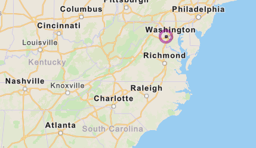

## Patriot CTF: Rouge Access Point

This was an OSINT challenge where we had to find the SSID of an access point, given the BSSID.

## The Challenge

```
We've received a notice from our companies EDR software that a laptop was attacked while they were on WFH. The employee says they were at home when it happened, but we suspect they were using public wifi. Our EDR software managed to capture the BSSID of the wifi (46:D1:FA:63:BC:66) network before it got disconnected, but not the SSID. Can you still find the network they were connected to?
```

From here, we have one important piece of information, which was the BSSID of the wifi `46:D1:FA:63:BC:66`.

## Solution

I used an online tool caled [WiGLE](https://wigle.net/) to look up the location of the access point.

Entering and filtering the BSSID to `46:D1:FA:63:BC:66`, I could see the location of the access point:



Next, I zoomed into the location to view the precise location and individual SSIDs as well. 


And we got the SSID! The flag was `PCTF{Red's table free wifi}`