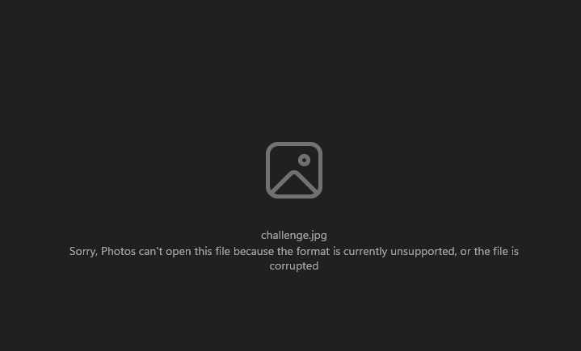

## Patriot CTF: Unsupported Format

This was an image fixing forensics challenge, where they gave a corrupted image file. The point was to fix the image and retrieve the flag.

## The Challenge

```
My friend sent me a picture of his brand new computer, but something strange happened to it and now it says "Unsupported Format" when I try to open it. Can you try to help me recover the image?
```

Trying to open the attached challenge image file would result in something like this:



But this tell us that the file is indeed supposed to be in jpg format.

## Solution

I used a forensic tool called `foremost` to fix the data structure of the corrupted file. It's a really simple command line tool:


The image was then sent to an `Output` folder which contained the fix image:


While it probably isn't identical to the original image, I could still piece together the flag parts to form the flag as `PCTF{c0rrupt3d_b1t5_4r3_c00l}`.

