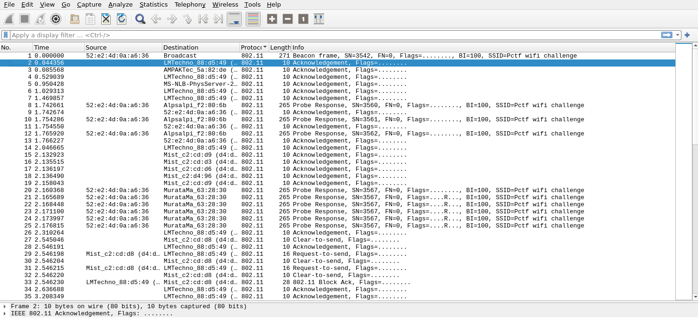

## Patriot CTF: WPA

This was an easy wifi hacking challenge which required the use of a dictionary attack to find out the password of a wifi password. The challenge pcap file can be found [here](savedcap.cap)

## The Challenge

```md
I really need to get on my friends WiFi, but he won't give me the password. I think he thinks I'll mess around on his network. I started a packet capture and left it running a while, I think someone connected to the network before I stopped the capture. Can you help me?
```

Looking at the pcap file, there were 888 packets with the 802.11 protocol, which is the WLAN protocol.


## Solution

I used the `aircrack-ng` tool to crack the WPA key using a dictionary attack with `rockyou.txt`.

```bash
callum@pop-os:~$ aircrack-ng -w Documents/wordlists/rockyou.txt Downloads/savedcap.cap
```

The output is as shown:
```bash
Reading packets, please wait...
Opening Downloads/savedcap.cap
Read 888 packets.

   #  BSSID              ESSID                     Encryption

   1  52:E2:4D:0A:A6:36  Pctf wifi challenge       WPA (1 handshake)

Choosing first network as target.

Reading packets, please wait...
Opening Downloads/savedcap.cap
Read 888 packets.

1 potential targets


                               Aircrack-ng 1.6 

      [00:00:00] 1829/10303727 keys tested (6531.55 k/s) 

      Time left: 26 minutes, 17 seconds                          0.02%

                           KEY FOUND! [ qazwsxedc ]


      Master Key     : D9 2A 24 C3 1D DB EF C0 58 AF 10 9F F2 F5 DE E9 
                       0C B6 EC F9 59 4E 39 7C 6E 50 E8 B5 3D 61 7E C4 

      Transient Key  : A8 6F FF 4C D2 0A 0B 59 5B 17 6E 27 32 63 29 9C 
                       D3 A6 4D 25 80 02 DF B8 39 C7 F1 46 08 E5 88 24 
                       2F 50 8A 5E D9 65 17 AD C6 AC DC 83 00 D6 D3 39 
                       37 77 DF 14 83 00 FF 3D E1 6D 13 CA D3 B4 40 C9 

      EAPOL HMAC     : 2F F5 73 C8 A5 66 B0 60 7D EF 8F 51 B0 64 F6 65 

```

Now we have the WPA key, which is the password we are looking for!

The flag is `PCTF{qazwsxedc}`