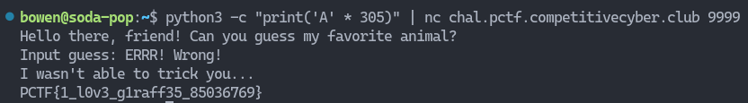

# Guessing Game

## Description

> No one seems to be able to guess my favorite animal... Can you?

You can download the source file [here](guessinggame)

## Decompilation

First, let's disassemble the file and have a look inside.

At first glance, it seems like the correct answer is `Giraffe`. However, if we continue reading, we see that no matter what input we give, it will always reject our input 😢

## Solution

In the decompilation output above, we can see that the program is using `gets` to retrieve user input. `gets` may vulnerable to a buffer overflow attack as it does not perform any sort of bounds checking, allowing us to write beyond the memory we are allocated.

To test this theory, lets send a long string of characters as our input using the following command:

`python3 -c "print('A' * 301)" | nc chal.pctf.competitivecyber.club 9999`

And we got the flag 🥳

Flag: `PCTF{1_l0v3_g1raff35_85036769}`
