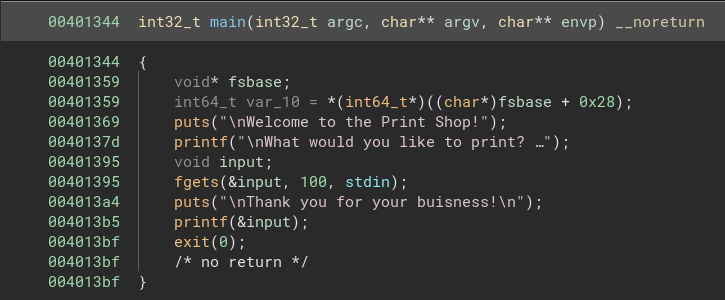
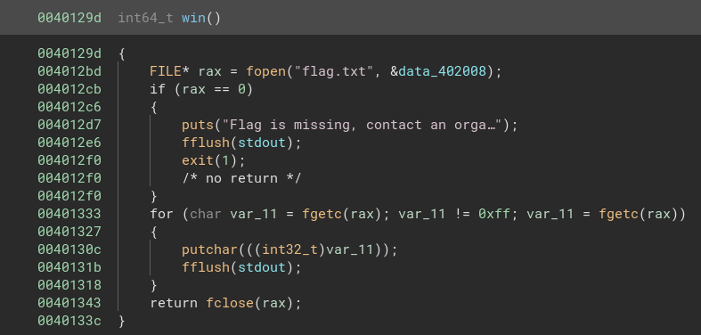
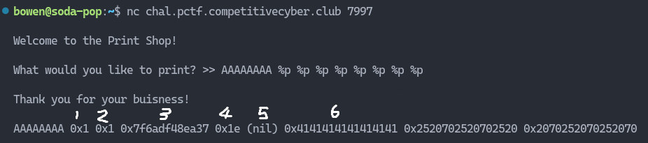
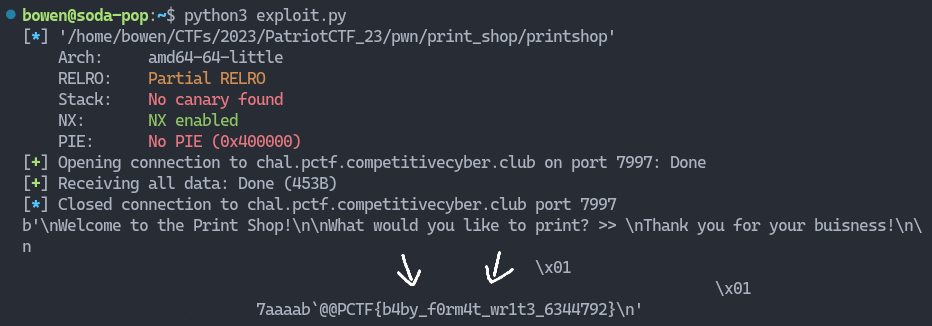

# Printshop

This pwn challenge involved exploiting a `printf` format string vulnerability to overwrite the `exit` function in the `GOT` table to point to the `win` function, which prints the flag.

## Description

> That print shop down the road is useless, can you make it do something interesting?

You can get the challenge file [here](printshop).

---

## Overview

Upon dumping the binary into a disassembler (in my case I use Binary Ninja), we see that there are 2 functions, `main` and `win`. However, `main` does not ever call `win` which means that we somehow have to control the instruction pointer to jump to the address of `win`.





## Format String Vulnerability

`printf` works by looking at the first argument for any format strings, and replaces them with the values on the stack. The normal way `printf` is used is shown below. Lets say you store your user input in the value `x`, and would like to display it:

```c
int x = 1;  // Somehow get user input inside here
printf("The value of x is: %d", x);
```

`%d` will be replaced with the value of `x`, and we'll all go our merry way. However, when user input is supplied as the first argument, that's when things go south. You see, when `printf` gets a format specifier in the first argument, it will read the first value on the stack even if no additional arguments are supplied!

```c
printf("The value of non existent is: %d");  // This is valid C code!
```

`printf` has a format specifier `%p`, which prints out the addresses of the argument(s) supplied, or more specifically, the arguments on the stack. Since our input is directly passed as the first argument, we can use this to leak addresses and find where our input is on the stack.

However, whats the point of leaking addresses when you can't write to it? It's just like window shopping right? Well, `printf` has another format specifier, `%n`, that allows you to write the number of bytes printed to that address on the stack.

Using this, we are now able to both read and write to the values on the stack 🥳

## Finding the Input Offset

Lets start by finding out how far our inputs are from the start of the stack. By spamming a pattern of length `8` as the executable is 64-bit, followed by a bunch of `%p`s, we are able to examine the stack of the program.



In this example, I chose to use `A`, whose hex code is `0x41`. From the output, we can see that our input is the 6th from the beginning of the stack.

## Overwriting the GOT Entry

Now there's this thing called the [Global Offset Table (GOT)](https://en.wikipedia.org/wiki/Global_Offset_Table) that allows programs to call external functions such as `exit` and `system`. It does so by containing multiple entries to external functions along with their respective memory addresses.

However, we can overwrite the addresses which the GOT contains using various means, such as a buffer overflow, or in this case, a string format vulnerability.

Unfortunately, when I tried manually writing the values and calculating the offsets, it didn't seem to work 😢. I'll update this post once I manage to figure it out 😐

## Pwntools to the Rescue

Thankfully, `pwntools` has a function designed to exploit the vulnerability discussed above, called `fmtstr_payload`. Let's use that to craft an exploit. The first argument is the offset of the input from the start of the stack, and the second argument is a dictionary mapping between the address you want to overwrite, and the destination address.

```py
from pwn import *

elf = context.binary = ELF("./printshop")

p = remote("chal.pctf.competitivecyber.club", 7997)
payload = fmtstr_payload(6, {elf.got["exit"] : elf.sym["win"]})

p.sendline(payload)
print(p.recvall())
```

And we get the flag 🥳



Flag: `PCTF{b4by_f0rm4t_wr1t3_6344792}`
