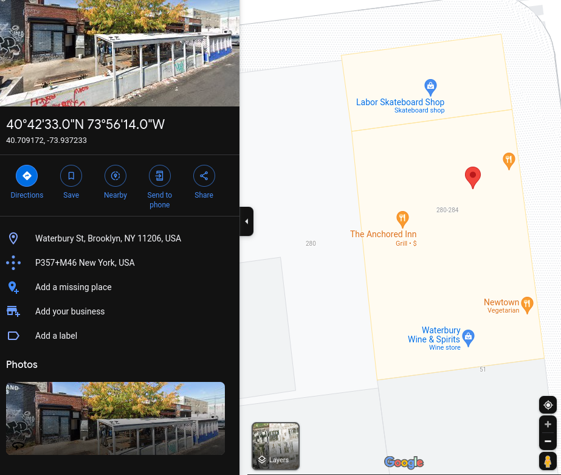

## SpookyCTF'23: Don't stick me there!

```
I woke up after a night out and I'm hurting uh... everywhere... I think I left my phone at one of the bars we were at last night. Thankfully, I was able to see the last photo I took through the cloud.

Can you help me find my phone? I need to know the name of the bar and when the photo was taken.

flagformat: NICC{Bar_Name-HH:MM:SS}
```

This was a simple forensics challenge. We are given a [photo](lastphoto.png) and we have to find out the name of the bar and the time the photo was taken.

## Analysing the File
Doing a quick `exiftool` gave us a bunch of [metadata](info.txt).
```bash
kairos@pop-os:~/Downloads$ exiftool lastphoto.png > info.txt
```

## Getting the Time
Scrolling through `info.txt`, searching up the `Create Date` would give the exact date and time the photo was taken.
```
Create Date                     : 2023:08:13 03:47:12.948-04:00
Date/Time Original              : 2023:08:13 03:47:12.948-04:00
Modify Date                     : 2023:08:13 03:47:12-04:00
```

Here, the time is 03:47:12.

## Getting the Location
Also from `info.txt`, there were GPS metadata from the image.
```
GPS Latitude                    : 40 deg 42' 33.02" N
GPS Longitude                   : 73 deg 56' 14.04" W
```
To search this location on Google Maps easily, we have to first change it from degrees minutes seconds to decimal degrees.

Using [this website](https://www.fcc.gov/media/radio/dms-decimal), we get the decimal degrees of the location: `40.709172, -73.937233`

Searching it up on Google Maps, I could see the location the image was taken at:


Looking at the stores nearby, The Anchored Inn was the only one labelled as a bar (`Bar & Grill`).

## Getting the Flag
Putting the name of the bar and the time the photo was taken into the flag format, we get the flag:
```
NICC{The_Anchored_Inn-03:47:12}
```