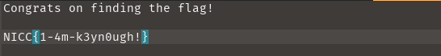

## SpookyCTF'23: If the Key Fits...

```
I am trying to escape this 64-story horror house and the only way to escape is by finding the flag in this text file! Can you help me crack into the file and get the flag? The only hint I get is this random phrase: MWwwdjM1eW1tM3RyMWNrM3Q1ISEh
```

This was a simple AES decrypting challenge. We are given a [flag.txt.aes](flag.txt.aes) file along with the random phrase.

## Getting the Key

Plugging the random phrase into a [Cipher Identifier](https://www.dcode.fr/cipher-identifier) online tool, it flagged it out as `Redefence Cipher` or `Base64 Coding`. 

I tried both tools, and base64 the actual key: 
```
1l0v35ymm3tr1ck3t5!!!
```

## Decrypting the File

Now that we have the key, we can go on with decrypting the AES file. I used AESCrypt's CLI tool:
```bash
kairos@pop-os:~/Downloads$ aescrypt -d  flag.txt.aes
Enter password:
```

Entering `1l0v35ymm3tr1ck3t5!!!` unlocked the file :D

Looking at flag.txt:



We got the flag :)