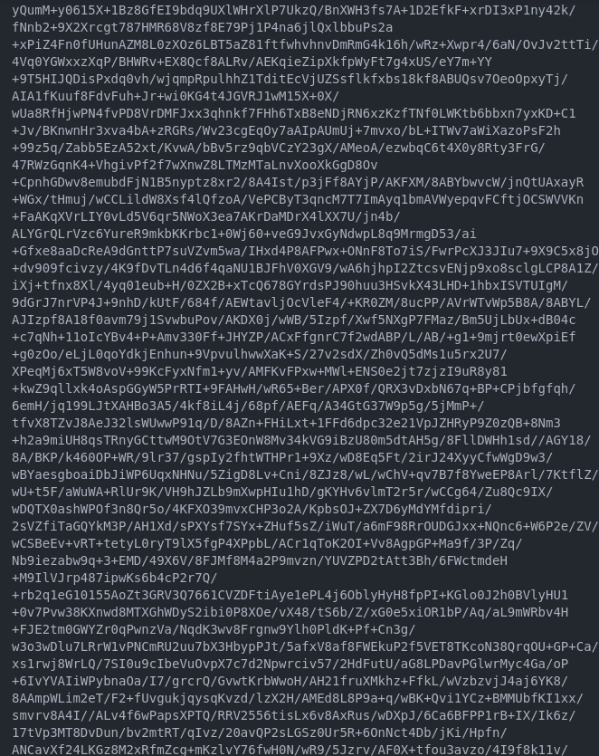
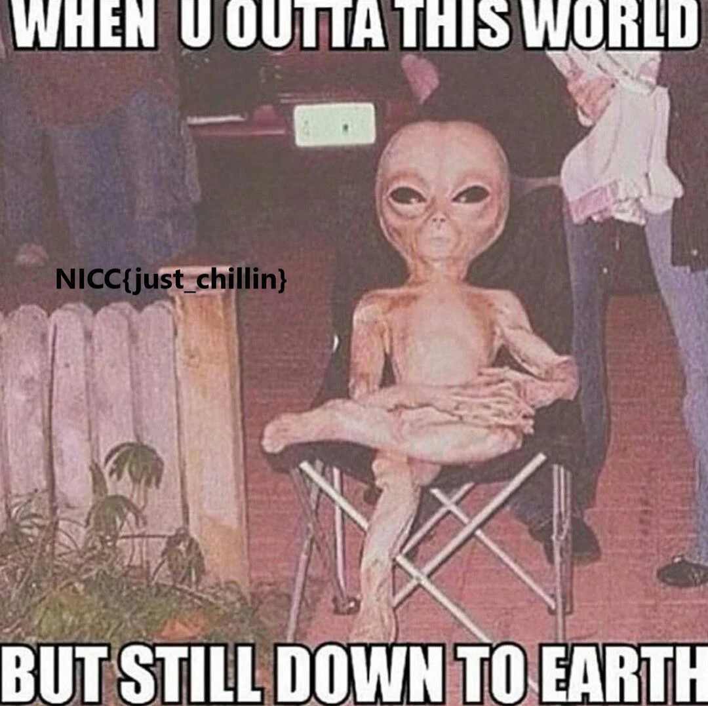

## SpookyCTF'23: What Have We Found Here...
```
As the sun dipped below the horizon, casting long shadows across the barren landscape, I stood alone at the edge of the world. The map had brought me here, to this remote and desolate place, in pursuit of a mystery that had captivated the world's greatest minds.

A cryptic message had been found on the ground, a message from the cosmos itself, or so it seemed. It hinted at the existence of extraterrestrial life, hidden within the depths of space. The message, a series of seemingly random characters, held secrets that could change everything we knew about the universe.

My task was to decipher it, to unlock its hidden meaning. The characters appeared to be encoded in a complex language, something that I cannot seem to figure out. The key to understanding lay within those symbols, like a cosmic puzzle waiting to be solved.

As I gazed up at the starry night sky, seeing the Leo Minor constellation in the sky, I knew that the fate of humanity rested on my ability to decode this enigmatic message, to uncover the truth hidden within the stars.
```

This was a simple cryptography challenge. We are given a [text file](found_notes.txt) containing a long string of weird characters.



## Identifying the Cipher

I copied the whole string of characters into a [Cipher Identifier](https://www.dcode.fr/cipher-identifier) online tool, and it indicated a high probability of Base64 encoding. 

## Solving for The Flag
Plugging it into a [base64 decrypting](https://www.dcode.fr/base-64-encoding) tool, it seemed that the ascii characters it generated was just complete gibberish. Here's a small snippet:
```
ã�eí,Q¸ia���õ¨]�æbß7q�·v�Ûj;î=hkukr>^SÖ¹ÜY�ÜÅU;s'\ö«3L$P�­CöWV*?�V"³�È7
�¦�ÆdÌÜ«)Îã���Ä6íæ�néZwP���¹jú%¤ØªØ_j�ɨ�:��:¸äc�ÈûÒH¬Í�=)#m��9��Æ]®Þõb���óUå�¤=ª&óCm�JV¸&Zvó��C®T�Z]«�c±¨Ù²¸§��ÌG�89©*%j]ÕdÉØ�Ó#Îî)Y¸¦£c<UÜ�xÏQP*�Ã5e�8â�´ÀzýÝ´å%s�jÒ«V3Ü�£�ÍMh¡U�}ê�È»ö¨§»�× Òµ�bÔGCÎw/ëK¶�)�­�ËT�_��SQ�1-º��}*±�Æå&�±Ë#mZ�]�ý�1«oÿ�v£sJjä�j6�]?:g��õzߺÍÄ�¼�ù}©ÃÃwq�­
```

Next, I tried to toggle it to the `File to Download` function on the same website, which produced an image file!

