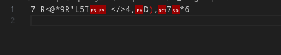

## encryption-activated
```
encryption-activated 
452
medium
133 solves

As weird as this may sound, RB seems to have decrypted some of Simon Letti's important document. Can figure out how to encrypt Simon's file to get recover the document?

Developed By:

TomB
```

Files:
- [encrypt.py](encrypt.py)
- [flag.output](flag.output)

This was a slightly confusing crypto challenge that wrecked my pea-sized brain (to be fair, I misunderstood the encryption script for a good 1/2 hour).

## The Challenge

We are given a Python file that is slightly complicated:

```py
def mycipher(myinput):
    global myletter
    rawdecrypt = list(myinput)
    for iter in range(0,len(rawdecrypt)):
        rawdecrypt[iter] = chr(ord(rawdecrypt[iter]) + ord(myletter))
        myletter = chr(ord(myletter) + 1)
    encrypted = "".join(rawdecrypt)
    print("NICC{" + encrypted + "}")
```

The encryption function first sets a global variable `myletter` and set an initial ASCII offset. The function modifies each character in the input by an incremental ASCII value and added the value of `myletter` to it. Each modification results in `myletter` being incremented by 1 in ASCII, thus, creating an increasing offset per character.

The output file looked a little goofy in my text editor:



## The Thought Process

Since there are only 128 ASCII codes, we can easily brute force the initial value and reverse the operations. Reversing the operations gave me a huge headache but its ok. 

```py
data = open("flag.output").read().split('\n')[0]

for i in range(128):
    rawdecrypt = list(data)
    myletter = chr(i)
    for iter in range(len(rawdecrypt)):
        try:
            rawdecrypt[iter] = chr(ord(rawdecrypt[iter]) + ord(myletter))
            myletter = chr(ord(myletter) + 1)
        except:
            break
    else:
        transformed_string = "".join(rawdecrypt)
        print(f"{i} {transformed_string}")
```

This snippet simply does the reverse of every operation in the encryption algorithm (duh...) but also just skips to the next ASCII if there are any errors during the transformation. 

## The Flag

Sifting through all the output, it seems that the ASCII value of `32` returned comprehensible English, which if we wrapped it around `NICC{}`, returned the flag.

```
...
28 S=p[`K[uKq[pDEJg[kb[Iu[_ElDan
29 T>q\aL\vLr\qEFKh\lc\Jv\`FmEbo
30 U?r]bM]wMs]rFGLi]md]Kw]aGnFcp
31 V@s^cN^xNt^sGHMj^ne^Lx^bHoGdq
32 WAt_dO_yOu_tHINk_of_My_cIpHer
33 XBu`eP`zPv`uIJOl`pg`Nz`dJqIfs
34 YCvafQa{QwavJKPmaqhaO{aeKrJgt
35 ZDwbgRb|RxbwKLQnbribP|bfLsKhu
36 [ExchSc}SycxLMRocsjcQ}cgMtLiv
...
```

Flag: `NICC{WAt_dO_yOu_tHINk_of_My_cIpHer}`

In hindsight, I think the lack of solves can be attributed to people missing the flag in the output or getting stuck on the encryption logic but oh well! You learn something new every day :)
