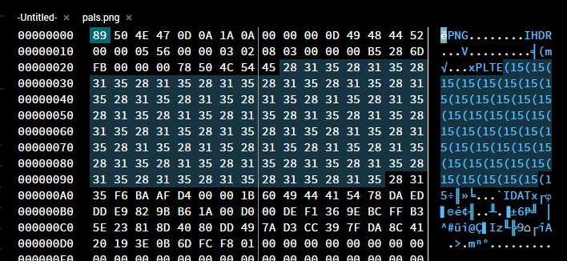
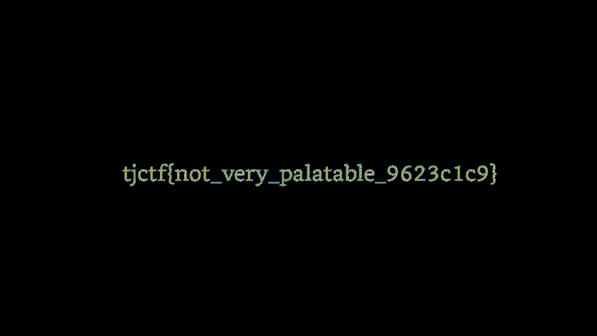

## TJCtf'24: Pals

This was a pretty interesting PNG forensics challenge that pertained to the concept of PNG-specific steganography
utilising the `PLTE` chunk, or the palette chunk. The challenge provided us with a PNG image, `pals.png`.


The image file can be downloaded [here](pals.png).

## The Initial Analysis

Given any image forensics challenge, the first step I would take would be to dump it
into [Aperi'Solve](https://aperisolve.fr/). Aperi'Solve is a pretty powerful tool that runs a bunch of image forensics
tools/scripts on the image like `strings`, `binwalk`, `exiftool`, `stegsolve`, etc. It's a great tool to get quick
indicators of what to look for.

Running the image through Aperi'Solve, there seem to be no immediate strings or metadata that could be of use. PNGCheck
did not show any errors, but it did have some suspicious output.

```bash
File: /app/uploads/9a4c4015406fe8548892954ac5ec75d9/image.png (7197 bytes)
chunk IHDR at offset 0x0000c, length 13
1366 x 770 image, 8-bit palette, non-interlaced
chunk PLTE at offset 0x00025, length 120: 40 palette entries
0: ( 40, 49, 53) = (0x28,0x31,0x35)
1: ( 40, 49, 53) = (0x28,0x31,0x35)
2: ( 40, 49, 53) = (0x28,0x31,0x35)
3: ( 40, 49, 53) = (0x28,0x31,0x35)
... (truncated)
36: ( 40, 49, 53) = (0x28,0x31,0x35)
37: ( 40, 49, 53) = (0x28,0x31,0x35)
38: ( 40, 49, 53) = (0x28,0x31,0x35)
39: ( 40, 49, 53) = (0x28,0x31,0x35)
chunk IDAT at offset 0x000a9, length 7008
zlib: deflated, 32K window, maximum compression
chunk IEND at offset 0x01c15, length 0
No errors detected in /app/uploads/9a4c4015406fe8548892954ac5ec75d9/image.png (4 chunks, 99.3% compression).
```

The `PLTE` chunk has 40 palette entries, all of which are the same colour. This explains why the image is fully grey!

## More About PNG Palette Chunk

According to [libpng](http://www.libpng.org/pub/png/spec/1.2/PNG-Chunks.html):

> The PLTE chunk contains from 1 to 256 palette entries, each a three-byte series of the form:
>
> Red:   1 byte (0 = black, 255 = red)
>
> Green: 1 byte (0 = black, 255 = green)
>
> Blue:  1 byte (0 = black, 255 = blue)

Essentially, the `PLTE` chunk is used to define the colour palette for the image. Each entry in the palette is a 3-byte
in RGB format.

The `PLTE` chunk starts with the hexadecimal values `50 4C 54 45` which translates to `PLTE` in ASCII. This is followed
by the palette entries. Looking at the file in an online hex editor, we can identify the `PLTE` section containing all
the repeating palette entries.



## The Approach

Since the image is fully grey, it is likely that the flag is somewhere in the image, but since the palettes are all the
same, the flag would too, be grey. A simple analogy would be to think of the flag being a text in a Word document, with
the flag text being grey, and the background of the document is grey too. The text is still there, but it's just not
visible.

So to extract the flag, we would need to edit the palette entries to use a different colour. But what colours? Well, it
doesn't really matter. I would just change the palette entries to all be different colours to ensure that there are no
repeating colours, making the flag visible.

## The Solution

One way would be to manually edit each palette entry to a different colour, but that would be tedious, especially with
40 palette entries, meaning you would have to change 120 bytes. Instead, I wrote a simple Python script to automate the
process.

```python
from PIL import Image

imgpath = '/home/kairos/Downloads/pals/pals.png'
img = Image.open(imgpath)

palette = img.getpalette()

def gen_color(num_colors):
    colors = []
    for i in range(num_colors):
        color = (i * 40 % 256, i * 85 % 256, i * 170 % 256)
        colors.extend(color)
    return colors

num_entries = 256
new_palette = gen_color(num_entries)

img.putpalette(new_palette)

output_path = 'pleasebetheflag.png'
img.save(output_path)
```

Quick and dirty, but it gets the job done. This script generates a new palette with various different colours and
replaces the existing palette in the image.

