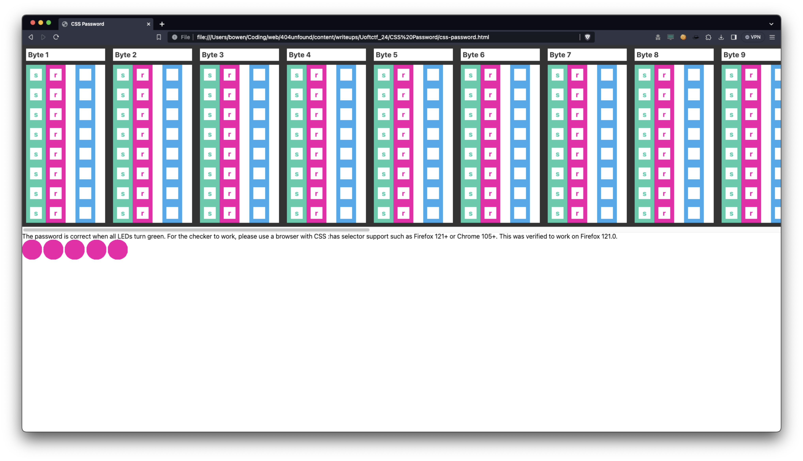
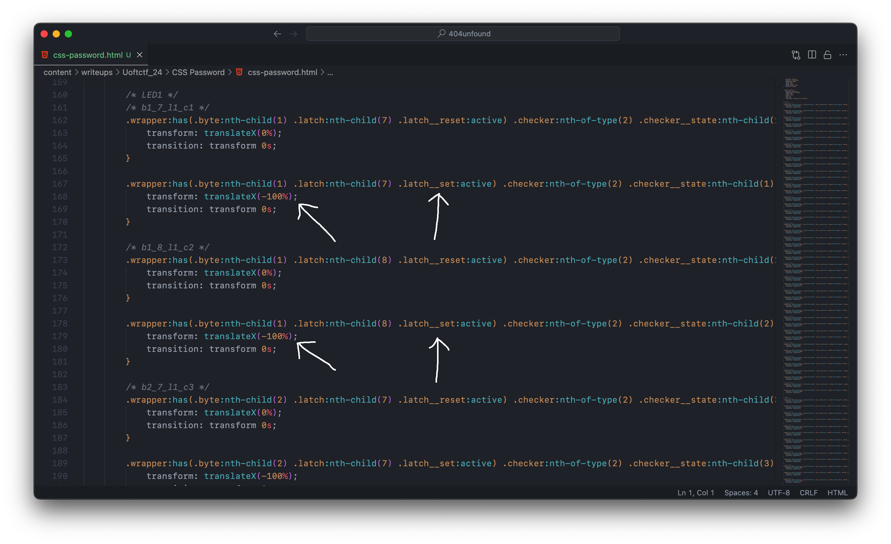
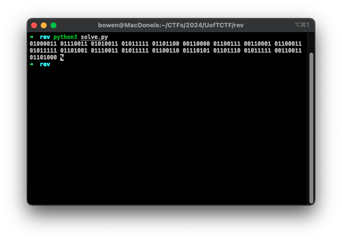
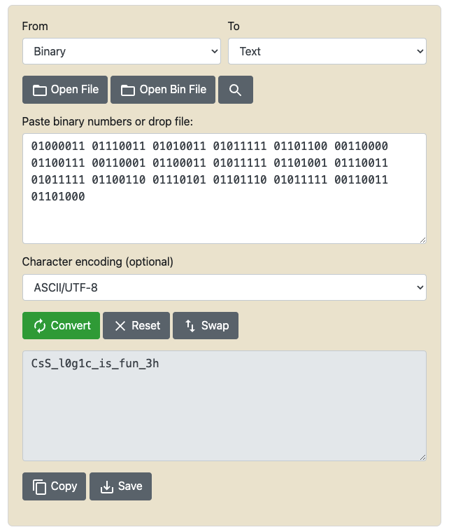

# CSS Password

This challenge was my first rev challenge and it really showed me the wonders of programming.
People who do rev at a high level are honestly a completely different breed.
The challenge author really woke up one day and decided to implement RAM in CSS, and CSS only.

## Description

> My web developer friend said JavaScript is insecure so he made a
> password vault with CSS. Can you find the password to open the vault?

The challenge file can be found [here](css-password.html).

---

## Initial State of Confusion

Upon opening the file, we see a whole load of classes and class names that seemingly
doesn't make sense at all. We are told to make all the LED lights turn green in order
to retrieve the flag. The first thought that came to mind was each of these bytes
represent a letter in the final flag, since ASCII values can be represented in binary.
Though this is indeed the correct way, I had absolutely no clue how I was going to pinpoint
the right value.



## The Big Aha Moment

After staring at my screen for a lot longer than I'd like to admit, and going down a rabbit
hole of searching how SR-Latches worked, I finally figured out how the LEDs were supposed to
turn green. Some of the repeating lines of CSS seem to set the `transform` to `translateX(-100%)`,
which moves the overlapping red circle off the screen. Once all the red circles are moved away,
the green circle below is revealed.

However, the `transform` is only changed when a certain condition is fulfilled, and the
condition seemed to be dependent on the `latch__set` or `latch__reset` class.



The `latch__set` class represented a `1` state, and `latch__reset` represents a `0` state.
The comments provided in the source code proved to be very helpful too. It states which
byte the bit belongs to. Using these information, we can write a script to parse out
the bit values and convert it to a string.

## Messy Ahh Parser

When we were solving this challenge, we had about an hour left thus we had to speedrun
the script. The code below would be quite messy, so this is kind of an apology in advance.

The script loads all the values into a dictionary that is structured as:

```py
bit_dictionary = {
    "byte_position": {
        "bit_position": "bit_value"  # These are all integers but you get the idea
    }
}
```

It looks for every comment that starts with `b`, indicating its a
comment about a bit, parses out the `byte` and `bit` position and
sets it as a key.

It continues looking for a line that contains `translateX(-100%)`,
which is what indicates that the switch is correct. Then depending
if the class above is `latch__set` or `latch__reset`, it sets the
dictionary value as `1` or `0`.

The dictionary is then sorted and joined together before I dumped the
value into a online binary to string converter, where I got the final flag.

```py
with open("css-password.html") as f:
    data = f.readlines()

output = []
for d in range(len(data) - 1):
    data[d] = data[d].strip()

    # Look for comment indicating that its about a bit
    if data[d].startswith("/* b"):
        output.append(data[d].strip("/* ").strip(" */").split("_")[0:2])

    # Adds the corresponding bit value depending on latch__set or latch__reset
    elif "-100%" in data[d+1] and not data[d].startswith(".latch__set:active~.latch__state"):
        output.append(0 if data[d].split(" ")[2].split(":")[0] == ".latch__reset" else 1)

bit_dictionary = {}

for i in range(len(output)):
    if i % 2 == 0:
        key = output[i]  # Set the byte_index key
    else:
        if int(key[0].strip('b')) not in bit_dictionary.keys():
            bit_dictionary[int(key[0].strip('b'))] = {}  # Parse and set the bit_index key

        bit_dictionary[int(key[0].strip('b'))][int(key[1])] = output[i]  # Set the value as 1 or 0

        # Sort bit index after every insertion (goofy ahh)
        bit_dictionary[int(key[0].strip('b'))] = dict(sorted(bit_dictionary[int(key[0].strip('b'))].items()))

# Sort the byte index
bit_dictionary = dict(sorted(bit_dictionary.items()))

# Join the values together and dump into binary to string converter
for byte, val in bit_dictionary.items():
    for idx, val2 in val.items():
        print(val2, end="")
    print(" ", end="")
```




Flag: `uoftctf{CsS_l0g1c_is_fun_3h}`
